# THE COLLEGE

## B.Tech Final Year Project Report

### Title: The College - Full-Stack Notes Management and Student Tools Platform

Submitted by:
[STUDENT NAME]
[ROLL NO]
[BRANCH]
[SEMESTER]

Under the guidance of:
[GUIDE NAME]
[DEPARTMENT]

[COLLEGE NAME]
[UNIVERSITY NAME]
[SESSION YEAR]

---

# CERTIFICATE

This is to certify that the project entitled "The College - Full-Stack Notes Management and Student Tools Platform" is a bonafide record of the work carried out by [STUDENT NAME] (Roll No: [ROLL NO]) under my supervision and guidance, in partial fulfillment of the requirements for the award of the Degree of Bachelor of Technology in [BRANCH] during the academic session [SESSION YEAR] at [COLLEGE NAME].

This project embodies the original work of the candidate and has not been submitted for the award of any other degree or diploma to the best of my knowledge and belief.

Guide:
[GUIDE NAME]
[DESIGNATION]
[DEPARTMENT]

Head of Department:
[HOD NAME]
[DEPARTMENT]

Date: [DATE]
Place: [PLACE]

---

# CANDIDATE DECLARATION

I, [STUDENT NAME] (Roll No: [ROLL NO]), hereby declare that the work presented in this B.Tech Final Year Project Report titled "The College - Full-Stack Notes Management and Student Tools Platform" is an original record of my work carried out under the supervision of [GUIDE NAME]. I confirm that this report has not been submitted in part or full to any other university or institution for the award of any degree or diploma.

The information and data given in this report is authentic to the best of my knowledge. This project report is not a reproduction, replication, or duplicate of any previously published or submitted work. All sources of information, code patterns, and third-party libraries used during this project have been duly acknowledged and cited in the References section.

Date: [DATE]
Place: [PLACE]

Signature of Candidate

---

# ACKNOWLEDGEMENT

I express my sincere gratitude to [GUIDE NAME] for valuable guidance, continuous encouragement, and constructive feedback throughout the project. I also thank the faculty of [DEPARTMENT] and [COLLEGE NAME] for providing the infrastructure and academic environment that enabled the successful completion of this work.

I would like to extend my appreciation to the Head of Department, [HOD NAME], for providing the necessary laboratory facilities and computational resources that were essential during the development and testing phases of this project.

I am also thankful to the open-source community for maintaining the numerous libraries, frameworks, and tools that form the technical backbone of this project, including React, Express.js, MongoDB, Cloudinary, and Firebase. The availability of well-documented open-source software significantly accelerated the development cycle and enabled the implementation of production-grade features.

I am grateful to my peers and family for their support and motivation throughout the duration of this project.

---

# CONTENTS

1. Title Page
2. Certificate
3. Candidate Declaration
4. Acknowledgement
5. Contents
6. CHAPTER I: INTRODUCTION
   - 1.1 Abstract / Project Synopsis
   - 1.2 Background and Problem Statement
   - 1.3 Scope and Objectives of Present Work
   - 1.4 Motivation and Significance
   - Table 1.1: Existing vs Proposed System
7. CHAPTER II: SYSTEM ANALYSIS AND REQUIREMENT SPECIFICATIONS
   - 2.1 Software Requirement Specification (SRS)
   - 2.1.1 Functional and Non-Functional Requirements
   - 2.1.1.1 Hardware Interfaces and Requirements
   - 2.1.1.2 Software Interfaces, Stack and Tools Used
   - 2.1.2 User Classes and Characteristics
   - 2.1.3 System Constraints and Assumptions
   - 2.1.4 External Interface Requirements
   - Table 2.1: Functional Requirements
   - Table 2.2: Non-Functional Requirements
   - Table 2.3: Hardware Requirements
   - Table 2.4: Software Stack
   - Table 2.5: Database Collection Schema
   - Table 2.6: Environment Variables Inventory
   - Table 2.7: API Endpoint Specification
8. CHAPTER III: SYSTEM DESIGN AND SYSTEM ARCHITECTURE
   - 3.1 Overall System Architecture
   - 3.2 DFD Level 0
   - 3.3 DFD Level 1
   - 3.4 ER Diagram
   - 3.5 System Flowchart
   - 3.6 Authentication Sequence Diagram
   - 3.7 Note Upload Sequence Diagram
   - 3.8 Database Schema / Table Design
   - 3.9 Component Architecture Diagram
   - Figure Index entries
9. CHAPTER IV: IMPLEMENTATION AND WORKING PRINCIPLE
   - 4.1 Core Algorithms
   - 4.2 Module Descriptions
   - 4.3 Authentication Module Detailed Flow
   - 4.4 Academic Hierarchy Module
   - 4.5 Notes Management Module
   - 4.6 Compiler and Sandbox Module
   - 4.7 AI Assistant Module
   - 4.8 Frontend Architecture and State Management
   - 4.9 Key Code Snippets
   - 4.10 Frontend/Backend Connectivity
   - 4.11 Error Handling Strategy
   - 4.12 Security Implementation
10. CHAPTER V: TESTING, RESULTS AND APPLICATION
    - 5.1 Test Strategy
    - 5.2 Unit-Level Test Cases
    - 5.3 Integration Test Cases
    - 5.4 UI/UX Test Cases
    - 5.5 Security Test Cases
    - 5.6 Performance Test Cases
    - 5.7 UI Screenshots
    - 5.8 Output Analysis
    - 5.9 Real-world Applications
11. CHAPTER VI: ADVANTAGES, LIMITATIONS AND FUTURE SCOPE
    - 6.1 Advantages
    - 6.2 Limitations
    - 6.3 Future Scope
    - 6.4 Lessons Learned
12. REFERENCES
13. TABLE INDEX
14. FIGURE INDEX
15. APPENDICES
    - Appendix A: Backend File Summary
    - Appendix B: Frontend File Summary
    - Appendix C: Documentation Inventory
    - Appendix D: Related Data Testing
    - Appendix E: Glossary and Abbreviations
    - Appendix F: Additional Test Cases
    - Appendix G: API Response Samples
    - Appendix H: Deployment Configuration

---

# CHAPTER I: INTRODUCTION

## 1.1 Abstract / Project Synopsis

The College is a comprehensive full-stack educational platform engineered to centralize academic notes and learning tools for students, administrators, and super administrators within a higher-education institutional context. The system addresses the persistent challenge of fragmented academic resource management by providing a structured, searchable, and role-secured digital repository organized along a well-defined academic hierarchy: session, course, branch, semester, subject, and notes.

The platform is architected as a decoupled client-server application. The backend is built upon Node.js and Express.js (version 4.21.2), employing a Model-View-Controller (MVC) pattern augmented by layered middleware for authentication, authorization, file handling, and rate limiting. Persistent data storage is managed through MongoDB (accessed via Mongoose ODM version 8.10.0), which houses thirteen distinct collections spanning user accounts, academic structure entities, notes metadata, feedback, contact submissions, newsletter subscriptions, and event records. File assets--primarily academic notes in PDF and image formats--are stored on Cloudinary, a cloud-based media management service, and are referenced by URL within the MongoDB Note documents. Additionally, a PostgreSQL database serves as a sandboxed query execution environment for SQL practice, operating in a transaction-and-rollback mode to ensure data isolation.

The frontend is implemented as a Single Page Application (SPA) using React 19 with React Router 7 for client-side navigation and Vite 6 as the build tool. Tailwind CSS 4 provides utility-first styling, while animation libraries such as GSAP and Motion deliver polished micro-interactions. The application implements a three-tier Role-Based Access Control (RBAC) model: students can browse, search, and download notes and access learning tools; administrators can upload and manage notes within their assigned course and department; and super administrators exercise full control over the academic data hierarchy and user management.

Authentication is implemented through JSON Web Tokens (JWT) stored in httpOnly cookies with secure and sameSite attributes configured for cross-site deployment. The platform supports both traditional email-and-password authentication (with mandatory email verification via Nodemailer and Gmail SMTP) and social authentication through Google OAuth (mediated by Firebase Authentication on the client and Firebase Admin SDK verification on the server).

Beyond core notes management, the platform integrates a Tools Hub providing browser-based code compilers for C, C++, Java, Python, and JavaScript, an HTML/CSS playground, a PostgreSQL sandbox editor with pre-seeded sample data, and a Git practice lab. An AI-powered study assistant module interfaces with configurable language model providers (Gemini or OpenAI-compatible APIs) to offer contextual academic guidance.

The application supports containerized deployment through Docker Compose with separate development and production profiles, and includes Nginx-based reverse proxy configuration for production environments. The project repository also contains design documentation for future tools including a regex tester, JSON formatter, DSA visualizer, markdown notes pad, API tester, Linux terminal simulator, ER diagram builder, MCQ practice engine, and quiz progress tracker.

The application name "The College" is used throughout the repository structure and backend codebase, while the client HTML title and AI assistant prompt also reference "Hellomates / The College" in the user interface and chatbot context.

## 1.2 Background and Problem Statement

Academic notes and resources in educational institutions are traditionally shared through informal channels such as personal messaging applications (WhatsApp groups, Telegram channels), email threads, scattered file-sharing services (Google Drive links with limited access control), and physical photocopies. This fragmented approach creates several systemic problems that adversely affect the educational experience:

**Discoverability**: Students, particularly those in the early semesters, struggle to locate relevant notes for their specific course, branch, semester, and subject combination. Material shared in messaging groups is quickly buried under subsequent conversations, and search functionality within these platforms is limited to keyword matching within message text rather than structured metadata queries.

**Quality Control**: Without a centralized upload and review mechanism, the quality and accuracy of shared notes vary widely. There is no institutional oversight or administrative approval process, leading to the circulation of outdated, incorrect, or incomplete materials. Students have no reliable way to distinguish between authoritative notes prepared by faculty and informal notes taken by peers.

**Long-term Accessibility**: Notes shared through transient channels are subject to link expiration, account deletion, group archival, and platform policy changes. Students who join a course in subsequent years may find that previously shared materials are no longer accessible. There is no persistent, institutionally backed archive.

**Administrative Oversight**: Institutions require role-specific controls to manage academic content. Department heads need visibility into what materials are being shared, course administrators need the ability to curate and approve content, and platform administrators need tools to manage the academic structure itself (adding new courses, branches, semesters, and subjects as the institution evolves).

**Lack of Integrated Learning Tools**: Students typically rely on multiple external websites and applications for programming practice, SQL queries, and other hands-on learning activities. This fragmented tool landscape increases cognitive overhead and reduces the time available for focused study.

**Security Concerns**: Informal sharing channels provide no authentication, authorization, or audit trail. Sensitive academic materials (such as internal question banks or proprietary study guides) lack access control when distributed through public messaging platforms.

The College addresses these issues by providing a secure, centralized platform with hierarchical organization, verified uploads, administrative oversight, feedback loops, and an integrated suite of learning tools. The platform is designed to serve as a single-entry-point digital academic portal that a college department or institution can deploy and customize for its specific academic structure.

## 1.3 Scope and Objectives of Present Work

### Scope

The scope of this project encompasses the design, development, testing, and documentation of a full-stack web application with the following functional boundaries:

- Provide a centralized, role-based platform for academic notes organized along a structured hierarchy of Session, Course, Branch, Semester, Subject, and Note.
- Implement three distinct user roles (Student, Admin, SuperAdmin) with appropriate access controls and dedicated user interfaces for each role.
- Offer learning tools such as multi-language code compilers (C, C++, Java, Python, JavaScript), an HTML/CSS playground, a PostgreSQL sandbox, and a Git practice lab through a unified Tools Hub interface.
- Support both traditional user authentication (email/password with email verification) and social login via Google OAuth using Firebase Authentication.
- Provide administrative control for academic hierarchy management (CRUD operations on sessions, courses, branches, semesters, and subjects) and user oversight (verification toggle, deletion, statistics).
- Enable user communication through feedback forms (with star ratings), contact forms, and newsletter subscription management.
- Integrate an AI-powered study assistant capable of contextual academic guidance.
- Support containerized deployment via Docker Compose for reproducible development and production environments.

### Objectives

The specific technical objectives of this project are:

1. Implement secure, stateless authentication using JWT tokens stored in httpOnly, secure, sameSite cookies with automatic session validation and expiration handling.
2. Design and implement a normalized MongoDB schema with thirteen collections supporting the academic data hierarchy, user management, and content metadata.
3. Build a comprehensive REST API with 60+ endpoints covering authentication, academic CRUD, notes management, feedback, contact, subscription, chatbot, and compiler operations.
4. Develop an interactive React-based frontend with code-splitting (lazy loading), protected routes, context-based global state management, and responsive design.
5. Implement a robust search and filtering system for notes using MongoDB text indexes with relevance-based scoring and multi-field regex filtering.
6. Design and implement a PostgreSQL sandbox that executes user queries within transactions that are always rolled back, ensuring data isolation and preventing persistent side effects.
7. Build multi-language compiler endpoints that handle code compilation and execution with timeout protection, unique file isolation, and automatic cleanup.
8. Integrate Cloudinary for cloud-based file storage with support for upload, update (with old file deletion), and delete operations.
9. Implement cascading dependent dropdowns in the frontend for academic data selection (Course -> Branch/Semester -> Subject) with data fetched dynamically from the API.
10. Ensure production readiness through Docker Compose configuration, Nginx reverse proxy setup, environment-based CORS and cookie configuration, and centralized error handling.

## 1.4 Motivation and Significance

The motivation for this project stems from the firsthand experience of navigating fragmented academic resource channels during undergraduate studies. The gap between the structured nature of academic curricula and the unstructured methods of resource sharing represents an opportunity to apply full-stack web development skills to solve a tangible institutional problem.

The significance of this project extends beyond its immediate utility:

- **Educational Value**: The project demonstrates proficiency in modern full-stack development, covering frontend (React, Vite, Tailwind CSS), backend (Node.js, Express.js), database (MongoDB, PostgreSQL), cloud services (Cloudinary, Firebase), containerization (Docker), and security (JWT, bcrypt, CORS).
- **Institutional Impact**: The platform can be deployed by any educational institution to improve academic resource management, reduce reliance on informal sharing channels, and provide integrated learning tools.
- **Scalability Foundation**: The modular architecture and clear separation of concerns provide a foundation for future extensions such as analytics dashboards, notification systems, and additional learning tools.

### Table 1.1: Existing vs Proposed System

| Aspect         | Existing System                  | Proposed System (The College)                                                        |
| -------------- | -------------------------------- | ------------------------------------------------------------------------------------ |
| Notes Access   | Scattered files, manual sharing  | Centralized, role-based repository with cloud storage                                |
| Organization   | Ad-hoc or folder-based           | Structured hierarchy (session -> course -> branch -> semester -> subject -> notes)   |
| Authentication | Often informal or none           | JWT-based with email verification, httpOnly cookies, social OAuth via Firebase       |
| Admin Control  | Limited or manual                | Multi-tier admin controls: Admin (course-scoped) and SuperAdmin (platform-wide)      |
| Search         | Manual discovery through groups  | Server-side full-text search with MongoDB text indexes + multi-field regex filtering |
| Learning Tools | Separate websites or none        | Integrated Tools Hub with 6 compilers, SQL sandbox, HTML/CSS playground, Git lab     |
| Feedback       | Informal verbal or none          | Structured feedback system with star ratings and admin review                        |
| File Storage   | Local drives, Google Drive links | Cloudinary cloud storage with automatic upload, update, and delete                   |
| Deployment     | Manual server setup              | Dockerized deployment with dev/prod profiles and Nginx reverse proxy                 |
| Security       | Minimal or no access control     | bcrypt password hashing, JWT auth, role-based middleware, rate limiting, CORS        |

---

# CHAPTER II: SYSTEM ANALYSIS AND REQUIREMENT SPECIFICATIONS

## 2.1 Software Requirement Specification (SRS)

The system follows a modular client-server architecture based on the Model-View-Controller (MVC) design pattern. The backend provides RESTful API endpoints organized into nine logical modules: authentication, academic structure management, notes management, feedback, contact, subscription, chatbot assistant, and compilers. The frontend provides protected routes for users, admins, and super admins with a consistent UI and contextual data loading via React Context and Axios interceptors.

The SRS document adheres to IEEE 830-1998 recommended practices for software requirements specifications. The system is categorized as a web-based information management and educational tools platform.

### 2.1.1 Product Perspective

The College is a self-contained web application designed to operate as an institutional academic portal. It interfaces with the following external systems:

- **MongoDB Atlas**: Cloud-hosted document database for persistent data storage.
- **Cloudinary**: Cloud-based media management platform for file upload, storage, transformation, and delivery.
- **Firebase Authentication**: Google's identity platform for social login (Google OAuth 2.0) and Firebase Admin SDK for server-side token verification.
- **Gmail SMTP**: Google's email service for sending verification emails via Nodemailer.
- **PostgreSQL**: Relational database used exclusively for the SQL sandbox feature.
- **AI Language Model API**: Configurable provider (Google Gemini or OpenAI-compatible API) for the study assistant chatbot.

### 2.1.2 Product Functions Summary

The system provides the following high-level functions:

1. Multi-role user registration, authentication, and session management.
2. Academic hierarchy creation and management (session, course, branch, semester, subject).
3. Notes upload, metadata management, search, filtering, and cloud-based file storage.
4. User feedback collection with star ratings.
5. Contact form submission and administrative review.
6. Newsletter subscription management.
7. AI-powered study assistant with conversation history.
8. Multi-language code compilation and execution (C, C++, Java, Python).
9. Client-side JavaScript execution environment.
10. PostgreSQL query sandbox with pre-seeded sample data.
11. HTML/CSS live playground.
12. Git practice lab simulation.
13. Platform statistics and dashboard for administrators.

## 2.1.1 Functional and Non-Functional Requirements

### Functional Requirements

| ID    | Requirement         | Description                                                                                                                                                                                 | Priority |
| ----- | ------------------- | ------------------------------------------------------------------------------------------------------------------------------------------------------------------------------------------- | -------- |
| FR-01 | User registration   | Users register with name, email, password, course, branch, and enrollment number.                                                                                                           | High     |
| FR-02 | Email verification  | All roles (User, Admin, SuperAdmin) verify email via time-limited JWT links (1-hour expiry).                                                                                                | High     |
| FR-03 | User login          | Verified users login with email/password; JWT stored as httpOnly cookie (1-day expiry).                                                                                                     | High     |
| FR-04 | Social login        | Users authenticate via Google OAuth using Firebase popup flow and backend token exchange.                                                                                                   | Medium   |
| FR-05 | Admin login         | Admins login and manage notes within their assigned course and department scope.                                                                                                            | High     |
| FR-06 | SuperAdmin login    | SuperAdmin authenticates with separate cookie (SuperauthToken) for platform-wide access.                                                                                                    | High     |
| FR-07 | Notes upload        | Admins upload notes with title, description, file, and academic metadata; files stored on Cloudinary. Validates admin course assignment, active semester, valid branch, and active subject. | High     |
| FR-08 | Notes search        | Users search with full-text query (MongoDB text index on title, description, subject) and filters (session, course, branch, semester, subject). Supports pagination and relevance sorting.  | High     |
| FR-09 | Notes listing       | Authenticated users view notes with uploader info populated via dynamic reference (refPath).                                                                                                | High     |
| FR-10 | Notes update/delete | Admins update note metadata and optionally replace files (old Cloudinary file deleted first).                                                                                               | High     |
| FR-11 | Feedback system     | Users submit feedback with message and star rating (1-5); admin/superadmin can view and delete.                                                                                             | Medium   |
| FR-12 | Contact system      | Users submit contact forms with name, email, phone, message; admins view and delete.                                                                                                        | Medium   |
| FR-13 | Subscription        | Users subscribe/unsubscribe to newsletter by email; admin can manage subscriber list.                                                                                                       | Low      |
| FR-14 | Academic CRUD       | SuperAdmin creates and manages sessions, courses, branches, semesters, and subjects with cascading deletes (deleting a course removes related branches, semesters, and subjects).           | High     |
| FR-15 | Chatbot assistant   | Authenticated users send messages to AI assistant with conversation history context.                                                                                                        | Medium   |
| FR-16 | C/C++ compilers     | Users submit C/C++ code; server compiles with gcc/g++ (10s timeout) and executes (5s timeout). Uses UUID-based temp files with automatic cleanup.                                           | Medium   |
| FR-17 | Java compiler       | Users submit Java code; server extracts class name via regex, compiles with javac, runs with java. Isolated working directory per compilation with recursive cleanup.                       | Medium   |
| FR-18 | Python compiler     | Users submit Python code; server executes with python command, falls back to py -3 on Windows.                                                                                              | Medium   |
| FR-19 | PostgreSQL sandbox  | Users execute SQL queries against pre-seeded temp tables (customers, orders, shippings) within a transaction that is always rolled back. 10-second statement timeout.                       | Medium   |
| FR-20 | Tool hub            | Tools catalog page provides navigation to all compilers, playgrounds, and learning modules.                                                                                                 | Medium   |
| FR-21 | Dashboard stats     | SuperAdmin dashboard displays aggregated statistics: total/verified/unverified/recent users and admins.                                                                                     | Medium   |
| FR-22 | User management     | SuperAdmin can list all users/admins, toggle verification status, and delete accounts.                                                                                                      | High     |
| FR-23 | Profile management  | Users and admins can update profile name, email, profile picture (uploaded to Cloudinary). Admins can also change passwords.                                                                | Medium   |
| FR-24 | Session validation  | Frontend polls backend every 15 seconds to validate active session; expired tokens trigger automatic logout via custom window event.                                                        | High     |
| FR-25 | Public home data    | Public endpoint returns latest 4 notes, platform statistics (student/note/subject/branch counts), and 3 latest feedback entries as testimonials.                                            | Medium   |

### Non-Functional Requirements

| ID     | Requirement                  | Description                                                                                                          | Metric / Target                       |
| ------ | ---------------------------- | -------------------------------------------------------------------------------------------------------------------- | ------------------------------------- |
| NFR-01 | Security                     | JWT with httpOnly cookies, bcrypt (10 salt rounds), role-based middleware, CORS with credentials.                    | Zero plaintext password storage       |
| NFR-02 | Performance                  | MongoDB text index for notes search; Promise.all for parallel queries in home data and dashboard stats.              | < 500ms API response time             |
| NFR-03 | Availability                 | Dockerized deployment with dev/prod profiles; graceful MongoDB connection error handling.                            | 99% uptime target                     |
| NFR-04 | Maintainability              | MVC architecture with separate controllers, routes, models, middleware, and utilities. ES Module imports throughout. | < 300 lines per controller file       |
| NFR-05 | Portability                  | Runs in Docker containers or local Node.js environment; Vite proxy for dev, Nginx for production.                    | Cross-platform (Windows/Linux/macOS)  |
| NFR-06 | Scalability                  | Stateless JWT auth enables horizontal scaling; Cloudinary offloads file storage; PostgreSQL connection pooling.      | Supports concurrent compiler requests |
| NFR-07 | Usability                    | Responsive design via Tailwind CSS; lazy loading with Suspense; toast notifications; animated transitions.           | Mobile and desktop compatible         |
| NFR-08 | External dependency handling | All external services (Cloudinary, Firebase, AI provider, PostgreSQL) configured via environment variables.          | Zero hardcoded credentials            |
| NFR-09 | Code quality                 | Centralized error handling (AppError + catchAsync pattern); consistent API response format.                          | Uniform error response structure      |
| NFR-10 | Rate limiting                | Login and chatbot endpoints protected by express-rate-limit (configurable window and max requests).                  | Prevents brute-force attacks          |

## 2.1.1.1 Hardware Interfaces and Requirements

### Table 2.3: Hardware Requirements

| Category           | Development Environment                                            | Production Environment                                        |
| ------------------ | ------------------------------------------------------------------ | ------------------------------------------------------------- |
| CPU                | Intel Core i5 (8th Gen) or equivalent, 2.0+ GHz                    | 2 vCPU cloud instance (AWS t3.medium or equivalent)           |
| RAM                | 8 GB minimum (16 GB recommended)                                   | 4 GB minimum                                                  |
| Storage            | 20 GB available (for node_modules, builds, Docker images)          | 40 GB SSD (for application, logs, Docker volumes)             |
| Network            | Broadband internet for Cloudinary, Firebase, MongoDB Atlas, AI API | Static IP or domain with HTTPS (TLS 1.2+)                     |
| Compiler toolchain | gcc, g++, javac/java (JDK 11+), python 3.8+ (or py -3 on Windows)  | Same compiler toolchain installed in Docker container or host |
| Display            | 1024x768 minimum resolution for development                        | N/A (headless server)                                         |

### Client-Side Hardware Requirements

| Category | Minimum Requirement                           |
| -------- | --------------------------------------------- |
| Browser  | Chrome 90+, Firefox 88+, Safari 14+, Edge 90+ |
| RAM      | 2 GB                                          |
| Network  | 1 Mbps broadband for file downloads           |
| Display  | 320px viewport width (responsive design)      |

## 2.1.1.2 Software Interfaces, Stack and Tools Used

### Table 2.4: Software Stack and Tools

| Layer        | Tools/Interfaces           | Version | Purpose                                                |
| ------------ | -------------------------- | ------- | ------------------------------------------------------ |
| Frontend     | React                      | 19.x    | Component-based UI library with virtual DOM            |
| Frontend     | React Router               | 7.x     | Client-side routing with nested and protected routes   |
| Frontend     | Vite                       | 6.x     | Build tool with HMR, ES modules, dev server with proxy |
| Frontend     | Tailwind CSS               | 4.x     | Utility-first CSS framework for responsive styling     |
| Frontend     | Axios                      | Latest  | Promise-based HTTP client with interceptors            |
| Frontend     | Firebase (client)          | 12.10.0 | Google OAuth popup flow for social authentication      |
| Frontend     | Monaco Editor              | Latest  | VS Code-based code editor for compiler pages           |
| Frontend     | React Toastify             | Latest  | Toast notification system for user feedback            |
| Frontend     | GSAP + Motion              | Latest  | Professional animation libraries                       |
| Frontend     | Lucide React + React Icons | Latest  | SVG icon libraries                                     |
| Backend      | Node.js                    | 18+     | JavaScript runtime for server-side execution           |
| Backend      | Express.js                 | 4.21.2  | Minimal web framework for REST API                     |
| Backend      | Mongoose                   | 8.10.0  | MongoDB ODM with schema validation and population      |
| Backend      | jsonwebtoken               | 9.0.2   | JWT creation and verification                          |
| Backend      | bcryptjs                   | 2.4.3   | Password hashing with configurable salt rounds         |
| Backend      | cookie-parser              | Latest  | HTTP cookie parsing middleware                         |
| Backend      | Nodemailer                 | 6.10.0  | Email sending via Gmail SMTP                           |
| Backend      | Firebase Admin SDK         | 13.7.0  | Server-side Firebase token verification                |
| Backend      | EJS                        | Latest  | Template engine for email verification pages           |
| Backend      | express-rate-limit         | Latest  | Request rate limiting middleware                       |
| Database     | MongoDB                    | 6+      | Document database for primary data storage             |
| Database     | PostgreSQL                 | 15+     | Relational database for SQL sandbox                    |
| Database     | pg (node-postgres)         | 8.20.0  | PostgreSQL client for Node.js with connection pooling  |
| File Storage | Cloudinary                 | 2.5.1   | Cloud media management (upload, transform, deliver)    |
| File Storage | multer                     | Latest  | Multipart form data parsing for file uploads           |
| File Storage | multer-storage-cloudinary  | Latest  | Multer storage engine for direct Cloudinary uploads    |
| DevOps       | Docker Compose             | Latest  | Multi-container orchestration for dev/prod             |
| DevOps       | Nginx                      | Latest  | Reverse proxy and static file serving in production    |
| DevOps       | dotenv                     | Latest  | Environment variable management                        |
| DevOps       | cors                       | Latest  | Cross-Origin Resource Sharing middleware               |

## 2.1.2 User Classes and Characteristics

The system defines three distinct user classes with hierarchical privilege levels:

| User Class     | Access Level | Key Characteristics                                                                                                                                                                                            | Authentication Cookie |
| -------------- | ------------ | -------------------------------------------------------------------------------------------------------------------------------------------------------------------------------------------------------------- | --------------------- |
| Student (User) | Basic        | Can browse academic tree, view/download notes, submit feedback/contact, use tools, access AI assistant. May register via email or Google OAuth.                                                                | authToken             |
| Admin          | Elevated     | All student capabilities plus: upload/edit/delete notes (scoped to assigned course and department), view students in assigned course, view feedback. Must specify course and department during registration.   | authToken             |
| SuperAdmin     | Full         | Platform-wide control: manage entire academic hierarchy (CRUD on sessions, courses, branches, semesters, subjects), manage all users and admins (verify/delete), view dashboard statistics, view all feedback. | SuperauthToken        |

## 2.1.3 System Constraints and Assumptions

### Constraints

1. **Compiler Execution Security**: Code compilation runs via child_process.execSync with timeout protection (10s compile, 5s execute) but does not employ OS-level sandboxing (e.g., Docker containers, chroot, or seccomp filters). This limits safe deployment to trusted user environments.
2. **Single-Server Compiler Model**: Compiler endpoints execute code on the same server process, which means heavy compilation loads can impact API responsiveness.
3. **PostgreSQL Sandbox Isolation**: SQL sandbox relies on PostgreSQL transaction rollback for isolation; DDL statements that auto-commit may bypass this mechanism in certain PostgreSQL configurations.
4. **Cookie-Based Auth Limitations**: Cross-origin cookie handling requires `secure: true` and `sameSite: "none"`, which mandates HTTPS in production and compatible browser configurations.
5. **Rate Limiter Configuration**: Current rate limits are set to 1000 requests per 15-minute window for testing; production deployment requires significant reduction.
6. **Email Service Dependency**: Email verification depends on Gmail SMTP with App Passwords, which is subject to Google's sending limits and policy changes.

### Assumptions

1. The deployment environment has Node.js 18+, gcc, g++, JDK 11+, and Python 3.8+ installed.
2. MongoDB Atlas or a local MongoDB instance is accessible with appropriate network permissions.
3. Cloudinary account is provisioned with sufficient storage and bandwidth for the expected volume of note uploads.
4. Firebase project is configured with Google Sign-In enabled and appropriate OAuth consent screen settings.
5. Users access the platform through modern web browsers with JavaScript enabled and cookie support active.

## 2.1.4 External Interface Requirements

### User Interfaces

The system provides responsive web interfaces tailored to each user role:

- **Public Pages**: Home (with latest notes, stats, testimonials), About, Contact, Services, Events, Terms, Privacy, Support.
- **Student Interface**: Login, Signup, Dashboard (sessions), Academic navigation (courses -> branches -> semesters -> subjects -> notes), AI Assistant, Feedback, Tools Hub, User Profile.
- **Admin Interface**: Admin Login, Admin Dashboard (stats, quick actions), Note Upload (cascading dropdowns), Manage Notes (search, edit, delete), User List, Admin Profile.
- **SuperAdmin Interface**: SuperAdmin Login, SuperAdmin Dashboard (user/admin statistics, management tables with search and pagination), Academic Management (tabbed CRUD for all five academic entities), Feedback Management.

### Communication Interfaces

- **HTTP/HTTPS**: All client-server communication via RESTful HTTP/HTTPS requests.
- **WebSocket**: Not implemented in current version; future scope for real-time notifications.
- **SMTP**: Outbound email via Gmail SMTP (port 465, TLS) for verification emails.

### Table 2.5: Database Collection Schema (MongoDB)

| Collection | Key Fields                                                                                                                                                                                                                                                                                                                        | Indexes                                   | Relationships                                  |
| ---------- | --------------------------------------------------------------------------------------------------------------------------------------------------------------------------------------------------------------------------------------------------------------------------------------------------------------------------------- | ----------------------------------------- | ---------------------------------------------- |
| User       | name (String, req), course (String), branch (String), enrollment (Number), email (String, req, unique), password (String, optional), profilePic (String), isVerified (Boolean), role (enum: student/admin), authProvider (enum: local/google/github), firebaseUid (String), timestamps                                            | email (unique)                            | Referenced by Feedback, Contact, Note          |
| Admin      | name (String, req), email (String, req, unique), password (String, req), role (String), isVerified (Boolean), course (String, req), department (String), college (String), designation (String), timestamps                                                                                                                       | email (unique)                            | Referenced by Note (via refPath)               |
| SuperAdmin | name (String, req, trim), email (String, req, unique, lowercase), password (String, req), role (String), isVerified (Boolean), timestamps                                                                                                                                                                                         | email (unique)                            | Creates academic entities                      |
| Note       | title (String, req), description (String), fileUrl (String, req), cloudinaryId (String, req), uploadedBy (ObjectId, refPath), uploaderModel (enum: User/Admin), session (String, req), course (String, req), branch (String, req), semester (String, req), subject (String, req), timestamps                                      | Text index: {title, description, subject} | Polymorphic ref to User or Admin               |
| Session    | year (Number, req, unique), startYear (Number), endYear (Number), isActive (Boolean), createdBy (ref SuperAdmin), timestamps                                                                                                                                                                                                      | year (unique)                             | Standalone                                     |
| Course     | name (String, unique), description (String), code (String, unique, lowercase), icon (String), color (String), isActive (Boolean), createdBy (ref SuperAdmin), timestamps                                                                                                                                                          | name (unique), code (unique)              | Referenced by Branch, Semester, Subject        |
| Branch     | name (String), fullName (String), code (String, lowercase), course (ref Course, req), isActive (Boolean), createdBy (ref SuperAdmin), timestamps                                                                                                                                                                                  | Compound: {name, course} unique           | Referenced by Subject                          |
| Semester   | name (String), number (Number, req), course (ref Course, req), isActive (Boolean), createdBy (ref SuperAdmin), timestamps                                                                                                                                                                                                         | Compound: {number, course} unique         | Referenced by Subject                          |
| Subject    | name (String), code (String), branch (ref Branch), semester (ref Semester), course (ref Course), isActive (Boolean), createdBy (ref SuperAdmin), timestamps                                                                                                                                                                       | Compound: {name, branch, semester} unique | Terminal node in academic hierarchy            |
| Feedback   | user (ref User, req), message (String, req), rating (Number, 1-5, req), timestamps                                                                                                                                                                                                                                                | --                                        | References User                                |
| ContactUS  | user (ref User, req), name (String, req), email (String, req), phone (String, req), message (String, req)                                                                                                                                                                                                                         | --                                        | References User                                |
| Subscribe  | email (String, req), timestamps                                                                                                                                                                                                                                                                                                   | --                                        | Standalone                                     |
| Event      | title (String), type (enum: Workshop/Conference/Webinar/Seminar/Meetup/Other), date (Date), startTime/endTime (String), location (nested: city/state/country/address/zipCode), description (String), image (String), organizer (nested: name/contactEmail/contactPhone), registrationUrl (String), isActive (Boolean), timestamps | --                                        | Standalone; virtual fields: isPast, isUpcoming |

### Table 2.6: Environment Variables Inventory

| Variable                          | Location | Required | Purpose                                                    |
| --------------------------------- | -------- | -------- | ---------------------------------------------------------- |
| PORT                              | Server   | Yes      | Express server listen port (e.g., 5000)                    |
| MONGO_URI                         | Server   | Yes\*    | MongoDB Atlas connection string                            |
| MONGO_DBLOCAL                     | Server   | Yes\*    | Local MongoDB fallback connection string                   |
| JWT_SECRET                        | Server   | Yes      | Secret key for JWT signing and verification                |
| FRONTEND_URL                      | Server   | Yes      | Allowed CORS origin (e.g., http://localhost:5173)          |
| BACKEND_PUBLIC_URL                | Server   | Yes      | Public URL for email verification links                    |
| EMAIL_USER                        | Server   | Yes      | Gmail address for sending verification emails              |
| EMAIL_PASS                        | Server   | Yes      | Gmail App Password (not regular password)                  |
| CLOUDINARY_CLOUD_NAME             | Server   | Yes      | Cloudinary account cloud name                              |
| CLOUDINARY_API_KEY                | Server   | Yes      | Cloudinary API key                                         |
| CLOUDINARY_API_SECRET             | Server   | Yes      | Cloudinary API secret                                      |
| FIREBASE_PROJECT_ID               | Server   | Yes      | Firebase project ID for Admin SDK                          |
| POSTGRES_URI                      | Server   | No\*\*   | PostgreSQL connection string for SQL sandbox               |
| POSTGRES_SSL                      | Server   | No       | Enable SSL for PostgreSQL connection                       |
| VITE_API_URL                      | Client   | No       | Backend API base URL (fallback: http://localhost:5000/api) |
| VITE_FIREBASE_API_KEY             | Client   | Yes      | Firebase client API key                                    |
| VITE_FIREBASE_AUTH_DOMAIN         | Client   | Yes      | Firebase auth domain                                       |
| VITE_FIREBASE_PROJECT_ID          | Client   | Yes      | Firebase project ID                                        |
| VITE_FIREBASE_STORAGE_BUCKET      | Client   | Yes      | Firebase storage bucket                                    |
| VITE_FIREBASE_MESSAGING_SENDER_ID | Client   | Yes      | Firebase messaging sender ID                               |
| VITE_FIREBASE_APP_ID              | Client   | Yes      | Firebase app ID                                            |

\*One of MONGO_URI or MONGO_DBLOCAL is required. \*\*Required only if SQL sandbox feature is enabled.

### Table 2.7: API Endpoint Specification (Complete)

#### Authentication Endpoints (/api/auth)

| Method | Path                 | Auth Required | Middleware Chain                              | Description                       |
| ------ | -------------------- | ------------- | --------------------------------------------- | --------------------------------- |
| POST   | /signup              | No            | --                                            | Register new user                 |
| POST   | /login               | No            | loginRateLimiter                              | Login user, set authToken cookie  |
| POST   | /logout              | No            | --                                            | Clear authToken cookie            |
| POST   | /google              | No            | --                                            | Social login via Firebase token   |
| GET    | /me                  | Yes (User)    | authenticateUser                              | Get current user profile          |
| GET    | /admin/me            | Yes (Admin)   | authenticateUser                              | Get current admin profile         |
| PUT    | /update-profile      | Yes (User)    | authenticateUser, upload.single("profilePic") | Update name and profile picture   |
| GET    | /verify/user/:token  | No            | --                                            | Verify user email via JWT link    |
| POST   | /signupAdmin         | No            | --                                            | Register new admin                |
| POST   | /loginAdmin          | No            | loginRateLimiter                              | Login admin, set authToken cookie |
| GET    | /verify/admin/:token | No            | --                                            | Verify admin email via JWT link   |
| GET    | /users               | Yes (Admin)   | authenticateUser, authorizeAdmin              | List users in admin's course      |

#### Notes Endpoints (/api/notes)

| Method | Path       | Auth Required | Middleware Chain                                        | Description                                      |
| ------ | ---------- | ------------- | ------------------------------------------------------- | ------------------------------------------------ |
| POST   | /upload    | Yes (Admin)   | authenticateUser, authorizeAdmin, upload.single("file") | Upload note with file and metadata               |
| GET    | /home-data | No            | --                                                      | Public: latest notes, stats, testimonials        |
| GET    | /          | Yes           | authenticateUser                                        | List notes with optional uploaderId filter       |
| GET    | /search    | Yes           | authenticateUser                                        | Full-text search with filters and pagination     |
| DELETE | /:id       | Yes (Admin)   | authenticateUser, authorizeAdmin                        | Delete note and Cloudinary file                  |
| PUT    | /:id       | Yes (Admin)   | authenticateUser, authorizeAdmin, upload.single("file") | Update note metadata and optionally replace file |

#### SuperAdmin Endpoints (/api/superadmin)

| Method | Path                 | Auth Required    | Description                      |
| ------ | -------------------- | ---------------- | -------------------------------- |
| POST   | /register            | No               | Register SuperAdmin              |
| POST   | /login               | No               | Login, set SuperauthToken cookie |
| GET    | /logout              | No               | Clear SuperauthToken cookie      |
| GET    | /verify/:token       | No               | Email verification               |
| POST   | /resend-verification | No               | Resend verification email        |
| GET    | /profile             | Yes (SuperAdmin) | Get SuperAdmin profile           |
| PUT    | /profile             | Yes (SuperAdmin) | Update SuperAdmin profile        |
| GET    | /stats               | Yes (SuperAdmin) | Dashboard statistics             |
| GET    | /users               | Yes (SuperAdmin) | List all users                   |
| DELETE | /users/:id           | Yes (SuperAdmin) | Delete user                      |
| PUT    | /users/:id/verify    | Yes (SuperAdmin) | Toggle user verification         |
| GET    | /admins              | Yes (SuperAdmin) | List all admins                  |
| DELETE | /admins/:id          | Yes (SuperAdmin) | Delete admin                     |
| PUT    | /admins/:id/verify   | Yes (SuperAdmin) | Toggle admin verification        |
| GET    | /feedback            | Yes (SuperAdmin) | List all feedback                |
| DELETE | /feedback/:id        | Yes (SuperAdmin) | Delete feedback                  |

#### Academic Endpoints (/api/academic)

| Method | Path           | Auth Required    | Description                                              |
| ------ | -------------- | ---------------- | -------------------------------------------------------- |
| GET    | /sessions      | No (Public)      | List active sessions                                     |
| POST   | /sessions      | Yes (SuperAdmin) | Create session                                           |
| PUT    | /sessions/:id  | Yes (SuperAdmin) | Update session                                           |
| DELETE | /sessions/:id  | Yes (SuperAdmin) | Delete session                                           |
| GET    | /courses       | No (Public)      | List active courses                                      |
| POST   | /courses       | Yes (SuperAdmin) | Create course                                            |
| PUT    | /courses/:id   | Yes (SuperAdmin) | Update course                                            |
| DELETE | /courses/:id   | Yes (SuperAdmin) | Delete course + cascading delete                         |
| GET    | /branches      | No (Public)      | List branches (filterable by ?course=)                   |
| POST   | /branches      | Yes (SuperAdmin) | Create branch                                            |
| PUT    | /branches/:id  | Yes (SuperAdmin) | Update branch                                            |
| DELETE | /branches/:id  | Yes (SuperAdmin) | Delete branch + related subjects                         |
| GET    | /semesters     | No (Public)      | List semesters (filterable by ?course=)                  |
| POST   | /semesters     | Yes (SuperAdmin) | Create semester                                          |
| PUT    | /semesters/:id | Yes (SuperAdmin) | Update semester                                          |
| DELETE | /semesters/:id | Yes (SuperAdmin) | Delete semester + related subjects                       |
| GET    | /subjects      | No (Public)      | List subjects (filterable by ?branch=&semester=&course=) |
| POST   | /subjects      | Yes (SuperAdmin) | Create subject                                           |
| PUT    | /subjects/:id  | Yes (SuperAdmin) | Update subject                                           |
| DELETE | /subjects/:id  | Yes (SuperAdmin) | Delete subject                                           |

#### Other Endpoints

| Mount          | Method | Path             | Auth  | Description                  |
| -------------- | ------ | ---------------- | ----- | ---------------------------- |
| /api/feedback  | POST   | /                | User  | Submit feedback              |
| /api/feedback  | GET    | /                | Admin | List all feedback            |
| /api/feedback  | DELETE | /:id             | Admin | Delete feedback              |
| /api/contact   | POST   | /                | User  | Submit contact form          |
| /api/contact   | GET    | /                | Admin | List all contacts            |
| /api/contact   | DELETE | /:id             | Admin | Delete contact               |
| /api/subscribe | POST   | /                | No    | Subscribe to newsletter      |
| /api/subscribe | POST   | /unsubscribe     | No    | Unsubscribe from newsletter  |
| /api/subscribe | GET    | /all             | Admin | List all subscribers         |
| /api/subscribe | DELETE | /:id             | Admin | Delete subscriber            |
| /api/chatbot   | POST   | /message         | User  | Send message to AI assistant |
| /api/compile   | POST   | /c               | No    | Compile and run C code       |
| /api/compile   | POST   | /cpp             | No    | Compile and run C++ code     |
| /api/compile   | POST   | /java            | No    | Compile and run Java code    |
| /api/compile   | POST   | /python          | No    | Execute Python code          |
| /api/query     | POST   | /                | No    | Execute PostgreSQL query     |
| /api/query     | GET    | /sandbox/preview | No    | Get sandbox table preview    |
| /api/query     | POST   | /sandbox         | No    | Execute sandboxed SQL query  |

---

# CHAPTER III: SYSTEM DESIGN AND SYSTEM ARCHITECTURE

## 3.1 Overall Architecture

The system follows a three-tier client-server architecture with a React-based presentation tier, an Express.js application tier, and a MongoDB/PostgreSQL data tier. External cloud services (Cloudinary, Firebase, AI providers) are accessed from the application tier via their respective SDKs and APIs.

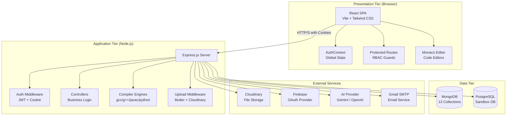
```mermaid
graph TD
  subgraph "Presentation Tier (Browser)"
    A[React SPA<br/>Vite + Tailwind CSS]
    A --> A1[AuthContext<br/>Global State]
    A --> A2[Protected Routes<br/>RBAC Guards]
    A --> A3[Monaco Editor<br/>Code Editors]
  end

  subgraph "Application Tier (Node.js)"
    B[Express.js Server]
    B --> B1[Auth Middleware<br/>JWT + Cookie]
    B --> B2[Controllers<br/>Business Logic]
    B --> B3[Compiler Engines<br/>gcc/g++/javac/python]
    B --> B4[Upload Middleware<br/>Multer + Cloudinary]
  end

  subgraph "Data Tier"
    C[(MongoDB<br/>13 Collections)]
    F[(PostgreSQL<br/>Sandbox DB)]
  end

  subgraph "External Services"
    D[Cloudinary<br/>File Storage]
    E[Firebase<br/>OAuth Provider]
    G[AI Provider<br/>Gemini / OpenAI]
    H[Gmail SMTP<br/>Email Service]
  end

  A -->|HTTP/S with Cookies| B
  B --> C
  B --> F
  B --> D
  B --> E
  B --> G
  B --> H
```

**Figure 3.1: Overall System Architecture**

The architecture is designed with the following principles:

1. **Separation of Concerns**: The frontend handles presentation and client-side state; the backend handles business logic, data validation, and external service integration; the database tier handles persistence.
2. **Stateless Application Tier**: JWT-based authentication eliminates server-side session storage, enabling horizontal scaling.
3. **Cloud-First File Storage**: Cloudinary handles all file storage, transformation, and CDN delivery, eliminating the need for local file system management on the server.
4. **Modular Route Mounting**: Each functional domain (auth, notes, academic, feedback, etc.) has its own Express Router, enabling independent development and testing.

## 3.2 DFD Level 0

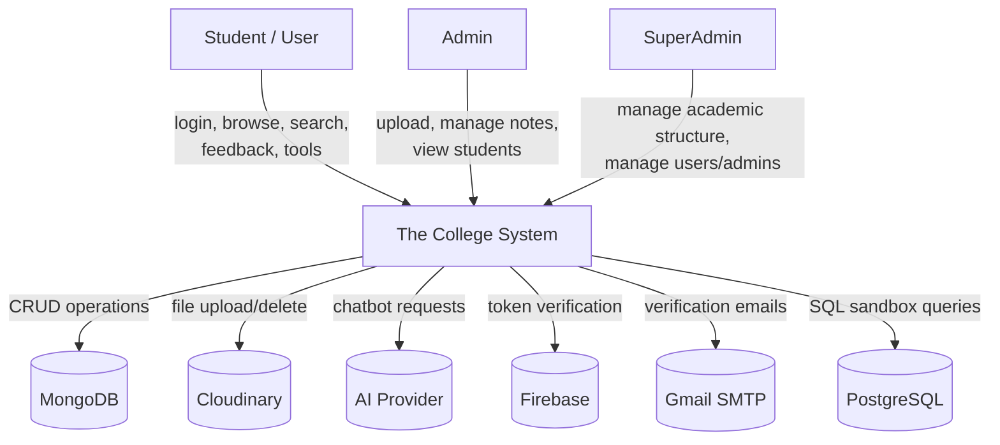
```mermaid
graph TD
  U[Student / User] -->|"login, browse, search,<br/>feedback, tools"| S[The College System]
  A[Admin] -->|"upload, manage notes,<br/>view students"| S
  SA[SuperAdmin] -->|"manage academic structure,<br/>manage users/admins"| S
  S -->|"CRUD operations"| DB[(MongoDB)]
  S -->|"file upload/delete"| CL[(Cloudinary)]
  S -->|"chatbot requests"| AI[(AI Provider)]
  S -->|"token verification"| FB[(Firebase)]
  S -->|"verification emails"| EM[(Gmail SMTP)]
  S -->|"SQL sandbox queries"| PG[(PostgreSQL)]
```

**Figure 3.2: Data Flow Diagram -- Level 0 (Context Diagram)**

The context diagram illustrates the system boundary and the interaction between three external actor types and six external data stores/services. All communication between actors and the system occurs via HTTP/HTTPS requests through the React frontend.

## 3.3 DFD Level 1

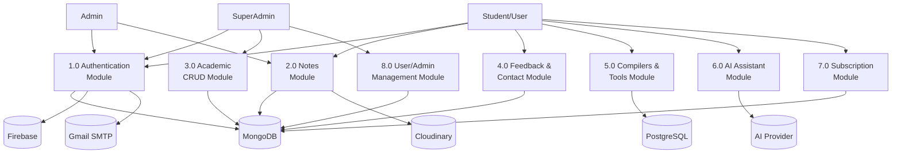
```mermaid
graph TD
  U[Student/User] --> Auth[1.0 Authentication<br/>Module]
  A[Admin] --> Auth
  SA[SuperAdmin] --> Auth
  Auth --> DB[(MongoDB)]
  Auth --> FB[(Firebase)]
  Auth --> EM[(Gmail SMTP)]

  U --> Notes[2.0 Notes<br/>Module]
  A --> Notes
  Notes --> DB
  Notes --> CL[(Cloudinary)]

  SA --> Academic[3.0 Academic<br/>CRUD Module]
  Academic --> DB

  U --> Feedback[4.0 Feedback &<br/>Contact Module]
  Feedback --> DB

  U --> Tools[5.0 Compilers &<br/>Tools Module]
  Tools --> PG[(PostgreSQL)]

  U --> Assistant[6.0 AI Assistant<br/>Module]
  Assistant --> AI[(AI Provider)]

  U --> Sub[7.0 Subscription<br/>Module]
  Sub --> DB

  SA --> Mgmt[8.0 User/Admin<br/>Management Module]
  Mgmt --> DB
```

**Figure 3.3: Data Flow Diagram -- Level 1**

The Level 1 DFD decomposes the system into eight functional modules, each with clearly defined data flows to the relevant data stores and external services.

## 3.4 ER Diagram (Conceptual)

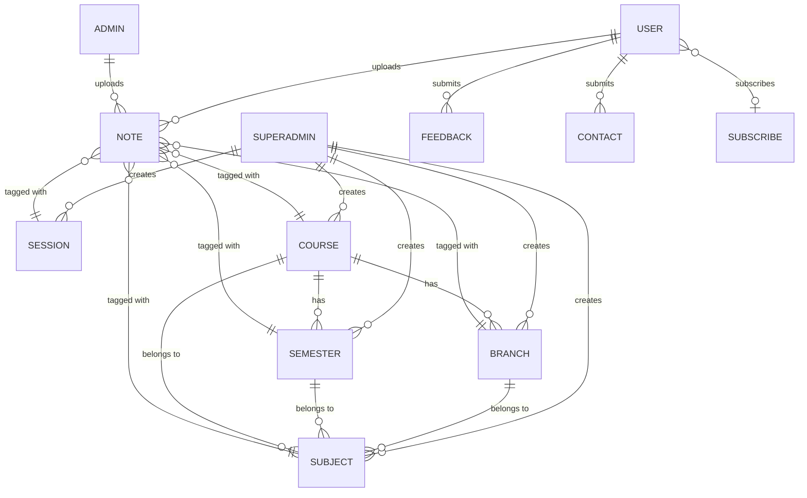
```mermaid
erDiagram
  SUPERADMIN ||--o{ SESSION : creates
  SUPERADMIN ||--o{ COURSE : creates
  SUPERADMIN ||--o{ BRANCH : creates
  SUPERADMIN ||--o{ SEMESTER : creates
  SUPERADMIN ||--o{ SUBJECT : creates

  COURSE ||--o{ BRANCH : has
  COURSE ||--o{ SEMESTER : has
  BRANCH ||--o{ SUBJECT : "belongs to"
  SEMESTER ||--o{ SUBJECT : "belongs to"
  COURSE ||--o{ SUBJECT : "belongs to"

  USER ||--o{ NOTE : uploads
  ADMIN ||--o{ NOTE : uploads
  USER ||--o{ FEEDBACK : submits
  USER ||--o{ CONTACT : submits
  USER }o--o| SUBSCRIBE : "subscribes"

  NOTE }o--|| SESSION : "tagged with"
  NOTE }o--|| COURSE : "tagged with"
  NOTE }o--|| BRANCH : "tagged with"
  NOTE }o--|| SEMESTER : "tagged with"
  NOTE }o--|| SUBJECT : "tagged with"
```

**Figure 3.4: Entity-Relationship Diagram**

The ER diagram illustrates the key relationships:

- **SuperAdmin** has a one-to-many relationship with all five academic entities (Session, Course, Branch, Semester, Subject) via the `createdBy` field.
- **Course** is the parent entity for Branch, Semester, and Subject, enforced by compound unique indexes.
- **Note** has a polymorphic many-to-one relationship with either User or Admin via the `uploadedBy` field with `refPath: 'uploaderModel'` (Mongoose dynamic reference).
- **Note** is tagged with string-based references to academic entities (session, course, branch, semester, subject) for flexible querying.

## 3.5 System Flowchart

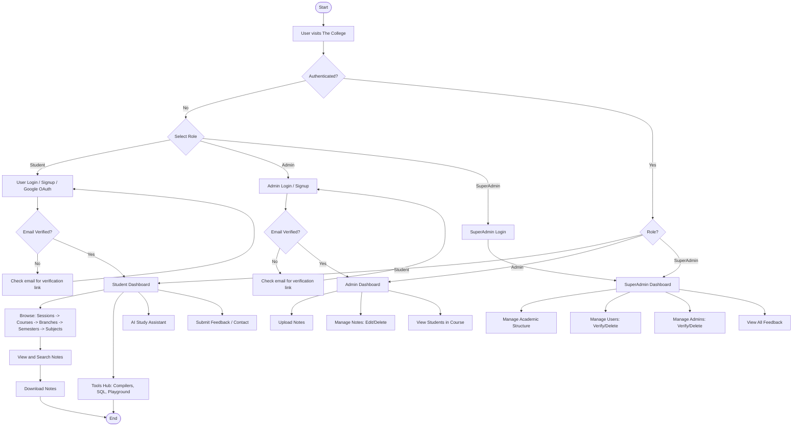
```mermaid
flowchart TD
  Start([Start]) --> Visit[User visits The College]
  Visit --> Auth{Authenticated?}

  Auth -->|No| RoleSel{Select Role}
  RoleSel -->|Student| SLogin[User Login / Signup / Google OAuth]
  RoleSel -->|Admin| ALogin[Admin Login / Signup]
  RoleSel -->|SuperAdmin| SALogin[SuperAdmin Login]

  SLogin --> EmailVer{Email Verified?}
  EmailVer -->|No| VerEmail[Check email for verification link]
  VerEmail --> SLogin
  EmailVer -->|Yes| SHome

  ALogin --> AEmailVer{Email Verified?}
  AEmailVer -->|No| AVerEmail[Check email for verification link]
  AVerEmail --> ALogin
  AEmailVer -->|Yes| APanel

  SALogin --> SAPanel

  Auth -->|Yes| SessionCheck{Role?}
  SessionCheck -->|Student| SHome
  SessionCheck -->|Admin| APanel
  SessionCheck -->|SuperAdmin| SAPanel

  SHome[Student Dashboard] --> Browse[Browse: Sessions -> Courses -> Branches -> Semesters -> Subjects]
  Browse --> NotesList[View and Search Notes]
  NotesList --> Download[Download Notes]
  SHome --> ToolsHub[Tools Hub: Compilers, SQL, Playground]
  SHome --> Assistant[AI Study Assistant]
  SHome --> FeedbackForm[Submit Feedback / Contact]

  APanel[Admin Dashboard] --> Upload[Upload Notes]
  APanel --> Manage[Manage Notes: Edit/Delete]
  APanel --> ViewUsers[View Students in Course]

  SAPanel[SuperAdmin Dashboard] --> AcademicCRUD[Manage Academic Structure]
  SAPanel --> UserMgmt[Manage Users: Verify/Delete]
  SAPanel --> AdminMgmt[Manage Admins: Verify/Delete]
  SAPanel --> ViewFeedback[View All Feedback]

  Download --> End([End])
  ToolsHub --> End
```

**Figure 3.5: System Flowchart**

## 3.6 Authentication Sequence Diagram

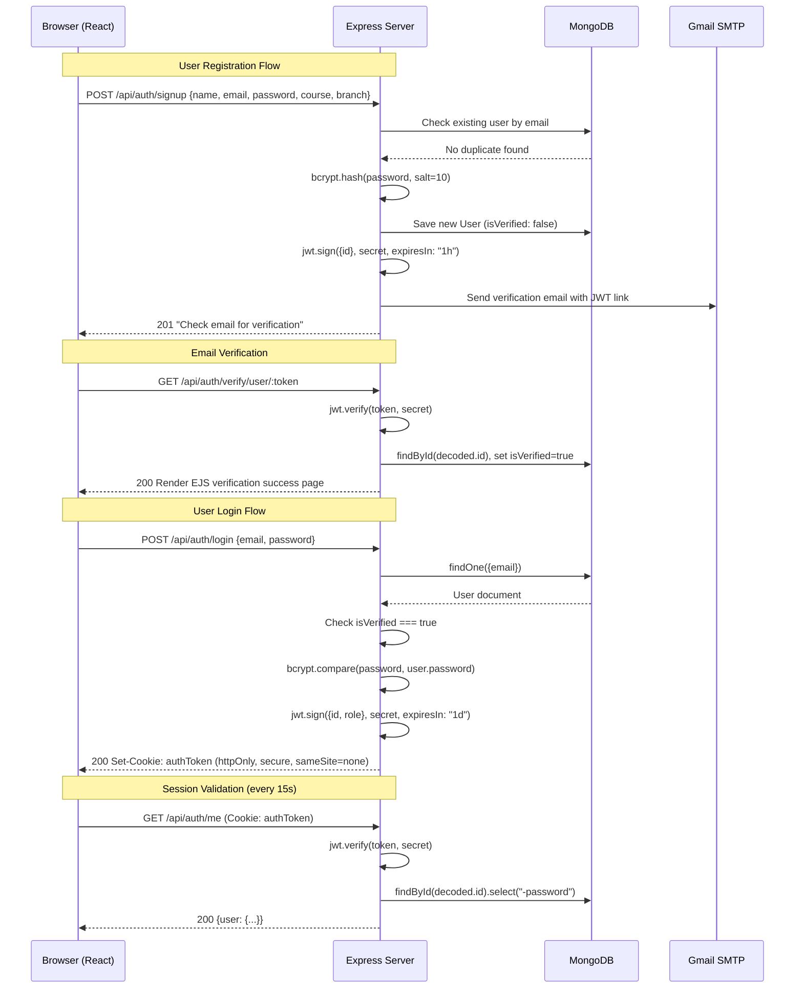
```mermaid
sequenceDiagram
  participant B as Browser (React)
  participant S as Express Server
  participant DB as MongoDB
  participant EM as Gmail SMTP

  Note over B,S: User Registration Flow
  B->>S: POST /api/auth/signup {name, email, password, course, branch}
  S->>DB: Check existing user by email
  DB-->>S: No duplicate found
  S->>S: bcrypt.hash(password, salt=10)
  S->>DB: Save new User (isVerified: false)
  S->>S: jwt.sign({id}, secret, expiresIn: "1h")
  S->>EM: Send verification email with JWT link
  S-->>B: 201 "Check email for verification"

  Note over B,S: Email Verification
  B->>S: GET /api/auth/verify/user/:token
  S->>S: jwt.verify(token, secret)
  S->>DB: findById(decoded.id), set isVerified=true
  S-->>B: 200 Render EJS verification success page

  Note over B,S: User Login Flow
  B->>S: POST /api/auth/login {email, password}
  S->>DB: findOne({email})
  DB-->>S: User document
  S->>S: Check isVerified === true
  S->>S: bcrypt.compare(password, user.password)
  S->>S: jwt.sign({id, role}, secret, expiresIn: "1d")
  S-->>B: 200 Set-Cookie: authToken (httpOnly, secure, sameSite=none)

  Note over B,S: Session Validation (every 15s)
  B->>S: GET /api/auth/me (Cookie: authToken)
  S->>S: jwt.verify(token, secret)
  S->>DB: findById(decoded.id).select("-password")
  S-->>B: 200 {user: {...}}
```

**Figure 3.6: Authentication Sequence Diagram**

## 3.7 Note Upload Sequence Diagram

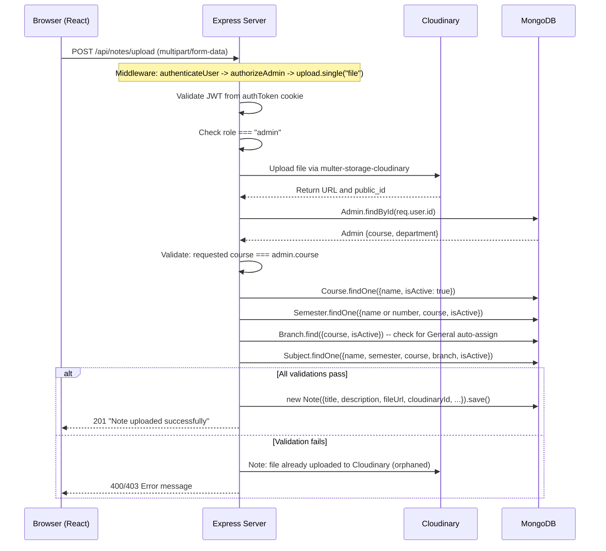
```mermaid
sequenceDiagram
  participant B as Browser (React)
  participant S as Express Server
  participant CL as Cloudinary
  participant DB as MongoDB

  B->>S: POST /api/notes/upload (multipart/form-data)
  Note over S: Middleware: authenticateUser -> authorizeAdmin -> upload.single("file")

  S->>S: Validate JWT from authToken cookie
  S->>S: Check role === "admin"
  S->>CL: Upload file via multer-storage-cloudinary
  CL-->>S: Return URL and public_id

  S->>DB: Admin.findById(req.user.id)
  DB-->>S: Admin {course, department}

  S->>S: Validate: requested course === admin.course
  S->>DB: Course.findOne({name, isActive: true})
  S->>DB: Semester.findOne({name or number, course, isActive})
  S->>DB: Branch.find({course, isActive}) -- check for General auto-assign
  S->>DB: Subject.findOne({name, semester, course, branch, isActive})

  alt All validations pass
    S->>DB: new Note({title, description, fileUrl, cloudinaryId, ...}).save()
    S-->>B: 201 "Note uploaded successfully"
  else Validation fails
    S->>CL: Note: file already uploaded to Cloudinary (orphaned)
    S-->>B: 400/403 Error message
  end
```

**Figure 3.7: Note Upload Sequence Diagram**

## 3.8 Database Schema / Table Design (Detailed)

The MongoDB schema follows separate collections for user roles, academic hierarchy, notes, and support entities. Key design decisions include:

1. **Polymorphic Association for Notes**: The Note collection uses Mongoose's `refPath` feature to create a dynamic reference. The `uploadedBy` field stores an ObjectId that can reference either the User or Admin collection, depending on the value of `uploaderModel`. This eliminates the need for separate note collections per uploader type.

2. **Compound Unique Indexes for Academic Entities**: Branch uses `{name, course}`, Semester uses `{number, course}`, and Subject uses `{name, branch, semester}` as compound unique indexes. This allows the same entity name to exist across different parent contexts while preventing duplicates within the same context.

3. **String-Based Academic References in Notes**: Unlike the academic hierarchy entities which use ObjectId references, the Note collection stores academic metadata (session, course, branch, semester, subject) as plain strings. This design decision prioritizes query flexibility and display performance over referential integrity, as notes are frequently queried with text-based filters.

4. **Text Index for Full-Text Search**: The Note collection has a compound text index on `{title: "text", description: "text", subject: "text"}`, enabling MongoDB's `$text` operator for relevance-scored full-text search.

5. **Event Model with Virtual Fields**: The Event model uses Mongoose virtual fields (`isPast`, `isUpcoming`) computed from the `date` field relative to the current time, avoiding the need for scheduled batch updates.

## 3.9 Component Architecture Diagram (Frontend)

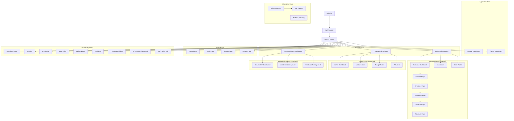
```mermaid
graph TD
  subgraph "Application Shell"
    Main[main.jsx] --> AuthProv[AuthProvider]
    AuthProv --> App[App.jsx Router]
    App --> Navbar[Navbar Component]
    App --> Footer[Footer Component]
  end

  subgraph "Route Guards"
    App --> PUR[ProtectedUserRoute]
    App --> PAR[ProtectedAdminRoute]
    App --> PSAR[ProtectedSuperAdminRoute]
  end

  subgraph "Public Pages"
    App --> Home[Home Page]
    App --> Login[Login Page]
    App --> Signup[SignUp Page]
    App --> Contact[Contact Page]
  end

  subgraph "Student Pages (Protected)"
    PUR --> Dash[Sessions Dashboard]
    Dash --> Courses[Courses Page]
    Courses --> Branches[Branches Page]
    Branches --> Semesters[Semesters Page]
    Semesters --> Subjects[Subjects Page]
    Subjects --> Notes[NotesList Page]
    PUR --> Assist[AI Assistant]
    PUR --> Profile[User Profile]
  end

  subgraph "Admin Pages (Protected)"
    PAR --> ADash[Admin Dashboard]
    PAR --> Upload[Upload Notes]
    PAR --> ManageN[Manage Notes]
    PAR --> AllUsers[All Users]
  end

  subgraph "SuperAdmin Pages (Protected)"
    PSAR --> SADash[SuperAdmin Dashboard]
    PSAR --> AcadMgmt[Academic Management]
    PSAR --> SAFeedback[Feedback Management]
  end

  subgraph "Tools Hub (Public)"
    App --> ToolsHome[CompilersHome]
    App --> CEdit[C Editor]
    App --> CppEdit[C++ Editor]
    App --> JavaEdit[Java Editor]
    App --> PyEdit[Python Editor]
    App --> JsEdit[JS Editor]
    App --> PGEdit[PostgreSQL Editor]
    App --> HTMLPlay[HTML/CSS Playground]
    App --> GitLab[Git Practice Lab]
  end

  subgraph "Shared Services"
    API[axiosInstance.js] --> AuthCtx[AuthContext]
    Firebase[firebase.js Config]
  end
```

**Figure 3.8: Frontend Component Architecture**

## Figure Index Entries (for Chapter III)

- Figure 3.1: Overall System Architecture
- Figure 3.2: DFD Level 0
- Figure 3.3: DFD Level 1
- Figure 3.4: ER Diagram
- Figure 3.5: System Flowchart
- Figure 3.6: Authentication Sequence Diagram
- Figure 3.7: Note Upload Sequence Diagram
- Figure 3.8: Frontend Component Architecture

---

# CHAPTER IV: IMPLEMENTATION AND WORKING PRINCIPLE

## 4.1 Core Algorithms

### Algorithm 1: JWT Cookie-Based Authentication

The authentication system employs a stateless, cookie-based approach using JSON Web Tokens. The algorithm operates in three phases: token generation, token transmission, and token validation.

**Token Generation (Login)**:

1. Receive credentials (email, password) from the client.
2. Query the database for a user/admin/superadmin matching the email.
3. Verify the account is email-verified (`isVerified === true`).
4. Compare the provided password against the stored bcrypt hash using `bcrypt.compare()`.
5. If valid, generate a JWT with payload `{id, role}`, signed with `JWT_SECRET`, with a 1-day expiration.
6. Set the token as an httpOnly cookie with attributes: `secure: true`, `sameSite: "none"`, `path: "/"`, `maxAge: 86400000` (24 hours in milliseconds).
7. Return user profile data in the response body.

**Token Transmission (Every Request)**:

1. The browser automatically attaches the httpOnly cookie to every request sent to the same origin (or cross-origin when `withCredentials: true` is set on the Axios instance).
2. No client-side JavaScript can read or modify the cookie, providing XSS protection.

**Token Validation (Middleware)**:

1. The `authenticateUser` middleware extracts the token from `req.cookies.authToken` or `req.cookies.SuperauthToken`.
2. If no cookie is found, it falls back to the `Authorization` header (supporting Bearer token format).
3. The token is verified using `jwt.verify(token, JWT_SECRET)`.
4. The decoded payload (`{id, role}`) is attached to `req.user` for downstream use.
5. If verification fails, all auth-related cookies are cleared and a 401 response is returned.

### Algorithm 2: Note Upload Validation Chain

The note upload process implements a multi-step validation chain that ensures data integrity across the academic hierarchy:

```
Input: {title, description, session, course, branch, semester, subject, file}
Actor: Authenticated Admin

Step 1: Field Validation
  IF any required field is missing THEN throw AppError(400)
  IF no file attached THEN throw AppError(400)
  Extract cloudinaryId from req.file.filename or req.file.public_id

Step 2: Admin Authorization
  Query Admin by req.user.id -> get {course, department}
  IF requested course != admin.course (case-insensitive) THEN throw AppError(403)

Step 3: Course Validation
  Query Course by admin.course name, isActive=true
  IF not found THEN throw AppError(400, "Course not active")

Step 4: Semester Resolution (two-pass)
  Pass 1: Query Semester by name (case-insensitive regex), course ObjectId
  IF not found:
    Pass 2: Extract numeric value from semester string
    Query Semester by number, course ObjectId
  IF still not found THEN throw AppError(400, "Invalid semester")

Step 5: Branch Resolution (with auto-detection)
  Query all active branches for the course
  IF only one branch AND it is "General":
    SET requestedBranch = "General" (auto-assign)
  ELSE IF admin has a department:
    SET requestedBranch = admin.department
  ELSE IF no branch specified AND multiple branches exist:
    throw AppError(400, "Branch required")
  Query Branch by requestedBranch name, course ObjectId

Step 6: Subject Validation
  Build filter: {name, semester ObjectId, course ObjectId, isActive=true}
  IF branchDoc exists: add branch ObjectId to filter
  Query Subject with filter
  IF not found THEN throw AppError(400, "Invalid subject")

Step 7: Persistence
  Create Note document with canonical names from DB documents
  Save to MongoDB
  Return 201 with note data
```

### Algorithm 3: Full-Text Notes Search with Relevance Scoring

```
Input: {query, subject, course, semester, branch, session, page, limit}

Step 1: Build Filter Object
  IF query is non-empty:
    filter.$text = {$search: query.trim()}
  FOR each field in [subject, course, semester, branch, session]:
    IF field value provided:
      filter[field] = {$regex: "^value$", $options: "i"}

Step 2: Pagination
  pageNum = parseInt(page) || 1
  limitNum = parseInt(limit) || 10
  skip = (pageNum - 1) * limitNum

Step 3: Query Construction
  Build Mongoose query: Note.find(filter)
    .populate("uploadedBy", "name email")
    .skip(skip).limit(limitNum)

Step 4: Sorting Strategy
  IF text search active:
    Add projection: {score: {$meta: "textScore"}}
    Sort by: {score: {$meta: "textScore"}, createdAt: -1}
  ELSE:
    Sort by: {createdAt: -1}

Step 5: Execute and Return
  Execute query, return notes array
```

### Algorithm 4: PostgreSQL Sandbox Execution

```
Input: {query} -- user-submitted SQL

Step 1: Acquire Connection
  Get client from pg connection pool

Step 2: Transaction Setup
  Execute: BEGIN
  Execute: SET LOCAL statement_timeout = 10000  (10 seconds)

Step 3: Bootstrap Sandbox Data
  Execute SANDBOX_BOOTSTRAP_SQL:
    CREATE TEMP TABLE customers (...)
    INSERT INTO customers VALUES (5 rows)
    CREATE TEMP TABLE orders (...)
    INSERT INTO orders VALUES (5 rows)
    CREATE TEMP TABLE shippings (...)
    INSERT INTO shippings VALUES (5 rows)

Step 4: Execute User Query
  rawResult = client.query(query)

Step 5: Rollback (ALWAYS)
  Execute: ROLLBACK
  -- All temp tables and user changes are discarded

Step 6: Normalize Result
  IF rawResult is array (multi-statement): take last element
  Extract rows, fields (column names), rowCount
  Return normalized result

Error Handling:
  ON ANY error: attempt ROLLBACK, release client, re-throw
  FINALLY: release client back to pool
```

### Algorithm 5: Multi-Language Code Compilation

```
Input: {code} -- source code string
Language: C | C++ | Java | Python

Step 1: Validate Input
  IF code is empty or not a string THEN return error

Step 2: Create Isolated Workspace
  Generate UUID-based unique identifier
  Create temp directory: os.tmpdir()/college-{lang}-compiler/
  Write code to temp file with appropriate extension

Step 3: Compilation (C/C++/Java only)
  C:    execSync("gcc file.c -o output", timeout: 10000)
  C++:  execSync("g++ file.cpp -o output", timeout: 10000)
  Java: Extract class name via regex /public\s+class\s+(\w+)/
        execSync("javac ClassName.java", timeout: 10000)

Step 4: Execution
  C/C++:  output = execSync("./output", timeout: 5000)
  Java:   output = execSync("java -cp dir ClassName", timeout: 5000)
  Python: output = execSync("python file.py", timeout: 10000)
          ON ENOENT: fallback to execSync("py -3 file.py")

Step 5: Cleanup (ALWAYS in finally block)
  Delete source file
  Delete compiled output (binary or .class files)
  Java: recursive delete of working directory

Step 6: Return
  Success: {output: stdout}
  Error:   {output: stderr or error.message}
```

## 4.2 Module Descriptions (Detailed)

### Backend Modules

| Module               | Controller File         | Lines | Functions | Key Dependencies                                                           |
| -------------------- | ----------------------- | ----- | --------- | -------------------------------------------------------------------------- |
| User Auth            | authController.js       | 192   | 7         | bcryptjs, jsonwebtoken, User model                                         |
| Admin Auth           | AdminController.js      | 267   | 8         | bcryptjs, jsonwebtoken, Admin/Course/Branch models                         |
| SuperAdmin Auth/Mgmt | SuperAdminController.js | 280   | 14        | bcryptjs, jsonwebtoken, SuperAdmin/User/Admin models                       |
| Academic CRUD        | AcademicController.js   | 289   | 20        | Session/Course/Branch/Semester/Subject models                              |
| Notes Management     | noteController.js       | 275   | 6         | Note/Admin/Course/Branch/Semester/Subject/User/Feedback models, Cloudinary |
| Feedback             | feedbackController.js   | 48    | 3         | Feedback model                                                             |
| Contact              | ContactController.js    | 57    | 3         | ContactUS model                                                            |
| Subscription         | SubscribeController.js  | 130   | 4         | Subscribe model                                                            |
| Chatbot              | chatbotController.js    | 13    | 1         | chatbotService (external)                                                  |
| Social Auth          | socialAuthController.js | 96    | 1         | Firebase Admin SDK, User model                                             |
| C Compiler           | ServerForC.js           | 48    | 1         | child_process, fs, crypto                                                  |
| C++ Compiler         | ServerForCpp.js         | 48    | 1         | child_process, fs, crypto                                                  |
| Java Compiler        | ServerForJava.js        | 51    | 1         | child_process, fs, crypto                                                  |
| Python Compiler      | ServerForPython.js      | 55    | 1         | child_process, fs, crypto                                                  |
| PostgreSQL Sandbox   | PostgresCompilier.js    | 158   | 4         | pg connection pool                                                         |

### Frontend Modules

| Module                           | Primary File                                         | Key State Variables                                        | API Endpoints Used                                       |
| -------------------------------- | ---------------------------------------------------- | ---------------------------------------------------------- | -------------------------------------------------------- |
| AuthContext                      | Context/AuthContext.jsx                              | user, admin, superAdmin, loading                           | /auth/me, /auth/admin/me, /superadmin/profile            |
| Sessions Dashboard               | Sessions/Dashboard.jsx                               | sessions, totals, loading                                  | /academic/sessions, /academic/courses, /notes            |
| Courses Navigation               | Courses/Courses.jsx                                  | courses, loading                                           | /academic/courses                                        |
| Branches Navigation              | Branches/Branches.jsx                                | branches, loading                                          | /academic/branches?course=                               |
| Semesters Navigation             | Semesters/Semester.jsx                               | semesters, loading                                         | /academic/semesters?course=                              |
| Subjects Navigation              | Subject/Subjects.jsx                                 | subjects, loading                                          | /academic/subjects?branch=&semester=                     |
| Notes Listing                    | Notes/NotesList.jsx                                  | notes, filteredNotes, searchQuery                          | /notes, /notes/search                                    |
| Admin Dashboard                  | AdminPages/AdminDashboard.jsx                        | dashboardCounts                                            | /all/users, /notes?uploaderId=                           |
| Note Upload                      | AdminPages/NoteUpload/UploadNote.jsx                 | formData, sessions, courses, branches, semesters, subjects | /academic/\*, /notes/upload                              |
| Manage Notes                     | AdminPages/ManageNotes.jsx                           | notes, searchQuery                                         | /notes?uploaderId=, /notes/:id, /notes/search            |
| SuperAdmin Dashboard             | SuperAdminPages/SuperAdminDashboard.jsx              | users, admins, stats, activeTab, searchTerm, currentPage   | /superadmin/stats, /superadmin/users, /superadmin/admins |
| Academic Management              | SuperAdminPages/AcademicManagement.jsx               | activeTab, data, form, editingItem                         | /academic/\* (all CRUD)                                  |
| AI Assistant                     | Pages/Assistant.jsx                                  | messages, input, chatHistory                               | /assistant (POST)                                        |
| Tools Hub                        | Pages/Compilers/CompilersHome.jsx                    | (stateless)                                                | --                                                       |
| Code Editors (C/C++/Java/Python) | Pages/Compilers/\*/Editor.jsx                        | code, output                                               | /compile/{lang}                                          |
| PostgreSQL Editor                | Pages/Compilers/PostgressCompiler/PostgresEditor.jsx | sql, outputRows, previewTables                             | /query/sandbox, /query/sandbox/preview                   |

## 4.3 Authentication Module Detailed Flow

The authentication module implements a three-tier RBAC system with distinct cookie names, middleware chains, and request properties for each role:

| Role       | Cookie Name    | Middleware                        | Request Property | Login Endpoint             | Logout Endpoint            |
| ---------- | -------------- | --------------------------------- | ---------------- | -------------------------- | -------------------------- |
| Student    | authToken      | authenticateUser                  | req.user         | POST /api/auth/login       | POST /api/auth/logout      |
| Admin      | authToken      | authenticateUser + authorizeAdmin | req.user         | POST /api/auth/loginAdmin  | POST /api/auth/logout      |
| SuperAdmin | SuperauthToken | authenticateSuperAdmin            | req.superAdmin   | POST /api/superadmin/login | GET /api/superadmin/logout |

**Cookie Clearing Strategy**: Both the user and admin logout functions clear the `authToken` cookie on two paths (`/` and `/api/auth`) to handle cases where the browser may have associated the cookie with a specific path. Similarly, the SuperAdmin logout clears `SuperauthToken` on both `/` and `/api/superadmin`.

**Frontend Session Management (AuthContext)**: On application mount, the AuthContext executes a three-stage authentication probe:

1. Attempt SuperAdmin profile fetch (`GET /superadmin/profile`) -- if successful, set superAdmin state.
2. Attempt Admin profile fetch (`GET /auth/admin/me`) -- if successful, set admin state.
3. Attempt User profile fetch (`GET /auth/me`) -- if successful, set user state.
4. If all three fail, clear all auth state (no active session).

This priority order ensures that if a user has multiple valid cookies (e.g., from testing), the highest-privilege role takes precedence. The `skipAuthHandler` config flag prevents the Axios interceptor from triggering logout during these probe requests.

**Periodic Session Validation**: After initial authentication, the AuthContext sets up a `setInterval` timer that runs every 15 seconds. It calls the appropriate profile endpoint based on the active role. If the request fails (expired token, server error), all auth state is cleared, triggering a logout.

**Social Login Flow (Google OAuth)**:

1. Client-side: Firebase `signInWithPopup(auth, googleProvider)` opens Google OAuth consent screen.
2. User authorizes and Firebase returns a `firebaseUser` object.
3. Client calls `firebaseUser.getIdToken()` to get a Firebase ID token.
4. Client sends the ID token to `POST /api/auth/google` via Axios.
5. Server verifies the token using `firebaseAdmin.auth().verifyIdToken(idToken)`.
6. Server extracts `{uid, email, name, picture}` from the decoded token.
7. If user exists in MongoDB: updates `firebaseUid` and `profilePic` if not set.
8. If new user: creates a User document with `isVerified: true` (social auth users skip email verification), `authProvider: "google"`, and default academic metadata.
9. Server generates a JWT and sets the same `authToken` cookie as regular login.

## 4.4 Academic Hierarchy Module

The academic data forms a hierarchical structure managed exclusively by the SuperAdmin:

```
Session (year-based, standalone)
  |
  v
Course (standalone -- "B.Tech", "BCA", "MCA")
  |
  +-- Branch (belongs to Course -- "CSE", "IT", "ECE", "General")
  |     |
  +-- Semester (belongs to Course -- "Semester 1" through "Semester 8")
  |     |
  +-----+-- Subject (belongs to Branch + Semester + Course)
              |
              v
         Note (tagged with Session + Course + Branch + Semester + Subject)
```

**Cascading Delete Behavior**:

- Deleting a **Course** triggers: `Branch.deleteMany({course: id})`, `Semester.deleteMany({course: id})`, `Subject.deleteMany({course: id})`, then `Course.findByIdAndDelete(id)`.
- Deleting a **Branch** triggers: `Subject.deleteMany({branch: id})`, then `Branch.findByIdAndDelete(id)`.
- Deleting a **Semester** triggers: `Subject.deleteMany({semester: id})`, then `Semester.findByIdAndDelete(id)`.

**Frontend Cascading Dropdowns (UploadNote Component)**:
The note upload form implements a cascading dependent dropdown pattern:

1. On mount: fetch all sessions and courses from the API.
2. When admin selects a course: fetch branches and semesters for that course.
3. When admin selects a semester: fetch subjects for the selected course, semester, and branch combination.
4. Admin's course and department are pre-populated from their profile and locked (non-editable).

## 4.5 Notes Management Module

The notes module is the core functional component of the platform. It handles the complete lifecycle of academic notes:

**Upload**: Admin-only operation with a multi-step validation chain (detailed in Algorithm 2). The file is uploaded to Cloudinary via `multer-storage-cloudinary` middleware before the controller logic executes. The controller then validates the academic metadata against the database and creates a Note document with the Cloudinary URL.

**Search**: Supports two search modes:

1. **Full-text search**: Uses MongoDB's `$text` operator with the text index on `{title, description, subject}`. Results are sorted by text relevance score (`$meta: "textScore"`) with `createdAt` as a secondary sort.
2. **Filter-only search**: Uses case-insensitive regex matching (`$regex: "^value$", $options: "i"`) on individual fields. Results are sorted by `createdAt` descending.

Both modes support pagination via `page` and `limit` query parameters.

**Client-Side Filtering (NotesList)**: The NotesList component implements additional client-side filtering with intelligent matching:

- **Course matching**: Handles abbreviations (e.g., "btech" matches "B.Tech") by normalizing both values (removing dots, spaces, and converting to lowercase).
- **Branch matching**: Resolves aliases (e.g., "gen" matches "General") using an includes-based comparison.
- **Semester matching**: Extracts numeric values for comparison (e.g., "6th Semester" matches "Semester 6").

**Delete**: Destroys the file from Cloudinary first using `cloudinary.uploader.destroy(note.cloudinaryId)`, then deletes the Note document from MongoDB.

**Update**: Updates title and description. If a new file is uploaded, the old Cloudinary file is destroyed before the new file reference is stored.

**Public Home Data**: The `getPublicHomeData` function uses `Promise.all` to execute six parallel database queries:

1. Latest 4 notes with uploader names populated.
2. Count of verified students.
3. Total notes count.
4. Active subjects count.
5. Active branches count.
6. Latest 3 feedback entries with user names, courses, and branches for testimonials.

## 4.6 Compiler and Sandbox Module

The platform provides six programming language execution environments:

| Language   | Route                    | Execution Method         | Timeout       | Cleanup Strategy           |
| ---------- | ------------------------ | ------------------------ | ------------- | -------------------------- |
| C          | POST /api/compile/c      | gcc compile + execute    | 10s + 5s      | Delete source + binary     |
| C++        | POST /api/compile/cpp    | g++ compile + execute    | 10s + 5s      | Delete source + binary     |
| Java       | POST /api/compile/java   | javac compile + java run | 10s + 5s      | Recursive directory delete |
| Python     | POST /api/compile/python | python/py -3 execute     | 10s           | Delete source file         |
| JavaScript | Client-side              | new Function(code)       | Browser limit | N/A (in-memory)            |
| PostgreSQL | POST /api/query/sandbox  | pg client query          | 10s (SQL)     | Transaction ROLLBACK       |

**Security Considerations for Compilers**:

- **Process isolation**: Each compilation creates unique files using `crypto.randomUUID()`, preventing filename collisions between concurrent requests.
- **Timeout protection**: `execSync` with explicit timeout values prevents infinite loops from blocking the server.
- **Cleanup guarantee**: All temp files are deleted in `finally` blocks, ensuring cleanup even on compilation/runtime errors.
- **JavaScript safety**: The JS compiler runs entirely in the browser using `new Function(code)` with overridden `console.log`/`console.error` to capture output. The original console methods are restored in a `finally` block.

**PostgreSQL Sandbox Architecture**:
The sandbox uses PostgreSQL's transaction mechanism to provide a safe query execution environment:

1. A connection is acquired from a `pg.Pool`.
2. A transaction is started with `BEGIN`.
3. A 10-second statement timeout is set with `SET LOCAL statement_timeout = 10000`.
4. Three temporary tables (customers, orders, shippings) are created and populated with sample data.
5. The user's query is executed against these tables.
6. The transaction is rolled back with `ROLLBACK`, discarding all changes.
7. The result is normalized to extract `{rows, fields, rowCount}`.

The `normalizePgResult` function handles edge cases: if the raw result is an array (multi-statement query), it takes the last element. It extracts column names from the `fields` array and provides a consistent response format.

## 4.7 AI Assistant Module

The AI assistant provides contextual academic guidance through a chat interface. The implementation follows a thin-controller pattern:

- **Controller** (`chatbotController.js`): Receives `{message, history}` from the client and delegates to the chatbot service.
- **Service** (`chatbotService.js`): Manages the AI provider configuration, constructs prompts with system context (referencing "Hellomates / The College"), sends requests to the configured AI provider (Gemini or OpenAI-compatible API), and returns the response with the model name used.
- **Frontend** (`Assistant.jsx`): Full chat interface with conversation sidebar, message bubbles, markdown rendering for AI responses, and conversation history management. The complete chat history is sent with each message to maintain context.

## 4.8 Frontend Architecture and State Management

The React frontend follows a component-based architecture with the following patterns:

**Code Splitting**: All page-level components are loaded using `React.lazy()` with `<Suspense>` fallback to a loading spinner. This reduces the initial bundle size and improves first-load performance.

**Global State via Context API**: The `AuthContext` provides authentication state (`user`, `admin`, `superAdmin`) and methods (`login`, `logout`, `googleLogin`, `Adminlogin`, `Adminlogout`, `superAdminLogin`, `superAdminLogout`) to all components via React's Context API. No external state management library (e.g., Redux) is used.

**Route Protection**: Three route guard components (`ProtectedUserRoute`, `ProtectedAdminRoute`, `ProtectedSuperAdminRoute`) wrap protected routes using React Router's `<Outlet>` pattern. Each guard checks the corresponding AuthContext state and redirects to the appropriate login page if not authenticated.

**Centralized HTTP Client**: A single Axios instance (`axiosInstance.js`) with `withCredentials: true` is shared across all components. A response interceptor catches 401 errors and dispatches a custom `session-expired` window event, which triggers automatic logout in the AuthContext.

**Component Decomposition**: Major pages are split into focused sub-components (e.g., `DashboardHeader`, `SessionCard`, `DashboardLoading`, `DashboardError`), promoting reusability and maintainability.

## 4.9 Key Code Snippets (from repository)

### Snippet A: Express app setup and routes

```javascript
// Server/server.js
app.use("/api/auth", authRoutes);
app.use("/api/notes", noteRoutes);
app.use("/api/feedback", feedbackRoutes);
app.use("/api/contact", ContactRoutes);
app.use("/api/superadmin", superAdminRoutes);
app.use("/api/subscribe", subscribeRoutes);
app.use("/api/academic", academicRoutes);
app.use("/api/chatbot", chatbotRoutes);
app.use("/api/query", postgresCompilerRoutes);
app.use("/api/compile/", cCompilerRoutes);
app.use("/api/compile/", cppCompilerRoutes);
app.use("/api/compile/", javaCompilerRoutes);
app.use("/api/compile/", pythonCompilerRoutes);
```

### Snippet B: JWT authentication middleware

```javascript
// Server/Middleware/authMiddleware.js
export const authenticateUser = (req, res, next) => {
  let token = req.cookies.authToken || req.cookies.SuperauthToken;
  if (!token) {
    const authHeader = req.header("Authorization");
    if (authHeader) {
      token = authHeader.startsWith("Bearer ")
        ? authHeader.slice(7)
        : authHeader;
    }
  }
  if (!token)
    return res
      .status(401)
      .json({ message: "Access denied! No token provided" });
  try {
    const decoded = jwt.verify(token, process.env.JWT_SECRET);
    req.user = decoded;
    next();
  } catch (error) {
    res.status(401).json({ message: "Invalid token" });
  }
};
```

### Snippet C: Note upload validation and creation

```javascript
// Server/Controllers/noteController.js
if (!title || !description || !course || !semester || !session || !subject) {
  throw new AppError("All fields are required", 400);
}
if (!req.file) {
  throw new AppError("File is required", 400);
}
const admin = await Admin.findById(req.user.id).select("course department");
if ((course || "").toLowerCase() !== (admin.course || "").toLowerCase()) {
  throw new AppError("You can upload notes only for your assigned course", 403);
}
```

### Snippet D: Notes search and filtering

```javascript
// Server/Controllers/noteController.js
if (query && String(query).trim()) {
  filter.$text = { $search: String(query).trim() };
}
if (subject) filter.subject = { $regex: `^${subject}$`, $options: "i" };
if (course) filter.course = { $regex: `^${course}$`, $options: "i" };
if (semester) filter.semester = { $regex: `^${semester}$`, $options: "i" };
if (branch) filter.branch = { $regex: `^${branch}$`, $options: "i" };
if (session) filter.session = { $regex: `^${session}$`, $options: "i" };
```

### Snippet E: PostgreSQL sandbox (transaction + rollback)

```javascript
// Server/Compilers/PostGres/PostgresCompilier.js
await client.query("BEGIN");
await client.query("SET LOCAL statement_timeout = 10000");
await client.query(SANDBOX_BOOTSTRAP_SQL);
const rawResult = await client.query(query);
await client.query("ROLLBACK");
```

### Snippet F: Axios with cookie-based auth

```javascript
// Client/src/Api/axiosInstance.js
const API = axios.create({
  baseURL: import.meta.env.VITE_API_URL,
  withCredentials: true,
  headers: { "Content-Type": "application/json" },
});
```

### Snippet G: AuthContext session checks with priority cascade

```javascript
// Client/src/Context/AuthContext.jsx
// Priority order: SuperAdmin -> Admin -> User
const saResponse = await API.get("/superadmin/profile", authProbeConfig);
const adminResponse = await API.get("/auth/admin/me", authProbeConfig);
const userResponse = await API.get("/auth/me", authProbeConfig);
```

### Snippet H: Periodic session validation

```javascript
// Client/src/Context/AuthContext.jsx
const validateCurrentSession = async () => {
  try {
    if (superAdmin) {
      await API.get("/superadmin/profile", authProbeConfig);
      return;
    }
    if (admin) {
      await API.get("/auth/admin/me", authProbeConfig);
      return;
    }
    if (user) {
      await API.get("/auth/me", authProbeConfig);
    }
  } catch (error) {
    clearAuthState();
  }
};
const intervalId = window.setInterval(validateCurrentSession, 15000);
```

### Snippet I: Global error handler with operational error distinction

```javascript
// Server/server.js
app.use((error, req, res, next) => {
  console.error(error.stack);
  const statusCode = error.statusCode || 500;
  const message = error.isOperational
    ? error.message
    : "Something went wrong. Please try again later.";
  res.status(statusCode).json({ status: error.status || "error", message });
});
```

### Snippet J: C compiler with UUID-based temp files

```javascript
// Server/Compilers/C_Programming/ServerForC.js
const id = crypto.randomUUID();
const tempDir = path.join(os.tmpdir(), "college-c-compiler");
fs.mkdirSync(tempDir, { recursive: true });
const filePath = path.join(tempDir, `${id}.c`);
try {
  fs.writeFileSync(filePath, code);
  execSync(`gcc "${filePath}" -o "${outPath}"`, { timeout: 10000 });
  const output = execSync(`"${outPath}"`, { timeout: 5000 }).toString();
  res.json({ output });
} finally {
  try {
    fs.unlinkSync(filePath);
  } catch {}
  try {
    fs.unlinkSync(outPath);
  } catch {}
}
```

### Snippet K: Social login with Firebase token verification

```javascript
// Server/Controllers/socialAuthController.js
const decodedToken = await firebaseAdmin.auth().verifyIdToken(idToken);
const { uid, email, name, picture } = decodedToken;
// New social auth users are auto-verified
user = new User({
  name: name || email.split("@")[0],
  email,
  isVerified: true,
  authProvider: provider || "google",
  firebaseUid: uid,
});
```

## 4.10 Frontend/Backend Connectivity

- **Development Proxy**: Vite's dev server proxies `/api` requests to the backend (port 5000) via `vite.config.js`, eliminating CORS issues during development.
- **Cookie Transmission**: Axios is configured with `withCredentials: true` to attach httpOnly cookies to every cross-origin API request.
- **CORS Configuration**: The Express server allows credentials from the configured `FRONTEND_URL` origin with methods `GET/POST/PUT/PATCH/DELETE/OPTIONS`.
- **Role-Specific Protected Routes**: React Router guards UI access based on AuthContext state, redirecting unauthenticated users to the appropriate login page.
- **Error Interception**: The Axios response interceptor catches 401 responses and dispatches a custom `session-expired` window event, which the AuthContext listens for to trigger automatic logout and state cleanup.

## 4.11 Error Handling Strategy

The backend employs two error handling patterns:

**Pattern 1: catchAsync + AppError (Modern)**
Used in: authController, noteController, chatbotController, PostgresCompiler.

```javascript
// utils/catchAsync.js
export default (fn) => (req, res, next) =>
  Promise.resolve(fn(req, res, next)).catch(next);

// utils/AppError.js
class AppError extends Error {
  constructor(message, statusCode) {
    super(message);
    this.statusCode = statusCode;
    this.status = `${statusCode}`.startsWith("4") ? "fail" : "error";
    this.isOperational = true;
    Error.captureStackTrace(this, this.constructor);
  }
}
```

Controllers wrapped in `catchAsync` can throw `AppError` instances, which are caught and forwarded to the global error handler. The global handler distinguishes operational errors (show custom message) from programming errors (show generic message).

**Pattern 2: Traditional try-catch**
Used in: AdminController, SuperAdminController, AcademicController, feedbackController, ContactController, SubscribeController.

These controllers use inline try-catch blocks with `res.status(500).json({ message: "Server error" })` in the catch block. This pattern is simpler but provides less granular error information.

## 4.12 Security Implementation

| Security Measure         | Implementation                                                              | Location                                              |
| ------------------------ | --------------------------------------------------------------------------- | ----------------------------------------------------- |
| Password Hashing         | bcrypt with 10 salt rounds                                                  | authController, AdminController, SuperAdminController |
| Token-Based Auth         | JWT with 1-day expiry, signed with JWT_SECRET                               | All auth controllers                                  |
| XSS Protection           | httpOnly cookies prevent JavaScript access to auth tokens                   | All login handlers                                    |
| CSRF Mitigation          | sameSite cookie attribute (currently "none" for cross-site)                 | All login handlers                                    |
| CORS Restriction         | Only FRONTEND_URL origin allowed with credentials                           | server.js                                             |
| Rate Limiting            | express-rate-limit on login and chatbot endpoints                           | RateLimitter.js                                       |
| Input Validation         | Required field checks, regex escaping for course names                      | Controllers                                           |
| Role-Based Access        | Middleware chains: authenticateUser, authorizeAdmin, authenticateSuperAdmin | Route definitions                                     |
| Cookie Cleanup           | Invalid/expired tokens trigger cookie clearing on multiple paths            | authMiddleware.js                                     |
| Compiler Isolation       | UUID-based temp files, execution timeouts, guaranteed cleanup               | Compiler modules                                      |
| SQL Injection Prevention | Transaction rollback in PostgreSQL sandbox                                  | PostgresCompilier.js                                  |
| Social Auth Verification | Firebase Admin SDK server-side token verification                           | socialAuthController.js                               |

---

# CHAPTER V: TESTING, RESULTS AND APPLICATION

## 5.1 Test Strategy

The testing approach for this project combines manual functional testing, API endpoint verification, and cross-browser compatibility testing. The strategy is organized into the following categories:

1. **Unit-Level Testing**: Individual controller functions and middleware are tested in isolation by sending HTTP requests with various input combinations and verifying response codes, response bodies, and database state changes.
2. **Integration Testing**: End-to-end flows (registration -> verification -> login -> action -> logout) are tested to verify correct interaction between controllers, middleware, models, and external services.
3. **UI/UX Testing**: Frontend pages are manually tested across different browsers and viewport sizes to verify layout, navigation, form submissions, error handling, and responsive behavior.
4. **Security Testing**: Authentication bypass attempts, cookie manipulation, and unauthorized access scenarios are tested to verify the effectiveness of security measures.
5. **Performance Testing**: API response times are measured under typical load conditions, and database query performance is verified with text indexes active.

## 5.2 Unit-Level Test Cases (Functional)

### Table 5.1: Authentication Module Test Cases

| TC ID | Test Case                      | Input                                       | Expected Output                                       | Status      |
| ----- | ------------------------------ | ------------------------------------------- | ----------------------------------------------------- | ----------- |
| TC-01 | User signup (valid)            | name, email, password, course, branch       | 201: "Check email for verification"                   | [PASS/FAIL] |
| TC-02 | User signup (duplicate email)  | Existing email                              | 400: "User already exists"                            | [PASS/FAIL] |
| TC-03 | User login (valid)             | Verified user credentials                   | 200: authToken cookie set, user data returned         | [PASS/FAIL] |
| TC-04 | User login (unverified)        | Unverified user credentials                 | 403: "User not verified"                              | [PASS/FAIL] |
| TC-05 | User login (wrong password)    | Valid email, wrong password                 | 400: "Invalid email or password"                      | [PASS/FAIL] |
| TC-06 | User login (nonexistent email) | Unknown email                               | 400: "Invalid email or password"                      | [PASS/FAIL] |
| TC-07 | Email verification (valid)     | Valid JWT token in URL                      | 200: EJS success page rendered, isVerified=true       | [PASS/FAIL] |
| TC-08 | Email verification (expired)   | Expired JWT token                           | 401: "Invalid or expired token"                       | [PASS/FAIL] |
| TC-09 | User logout                    | Authenticated session                       | 200: authToken cookie cleared                         | [PASS/FAIL] |
| TC-10 | Google social login (new user) | Valid Firebase ID token                     | 200: New user created, isVerified=true, authToken set | [PASS/FAIL] |
| TC-11 | Google social login (existing) | Firebase token for existing user            | 200: User updated, authToken set                      | [PASS/FAIL] |
| TC-12 | Admin signup (valid course)    | Admin data with valid course and department | 201: "Check email for verification"                   | [PASS/FAIL] |
| TC-13 | Admin signup (invalid course)  | Admin data with nonexistent course          | 400: "Invalid course selected"                        | [PASS/FAIL] |
| TC-14 | Admin signup (missing dept)    | Multi-branch course, no department          | 400: "Department is required"                         | [PASS/FAIL] |
| TC-15 | Admin login (valid)            | Verified admin credentials                  | 200: authToken cookie set, admin data returned        | [PASS/FAIL] |
| TC-16 | SuperAdmin login (valid)       | Verified SuperAdmin credentials             | 200: SuperauthToken cookie set                        | [PASS/FAIL] |
| TC-17 | SuperAdmin login (unverified)  | Unverified SuperAdmin                       | 403: "Email not verified"                             | [PASS/FAIL] |

### Table 5.2: Notes Module Test Cases

| TC ID | Test Case                         | Input                                                  | Expected Output                              | Status      |
| ----- | --------------------------------- | ------------------------------------------------------ | -------------------------------------------- | ----------- |
| TC-18 | Note upload (valid)               | Title, desc, file, valid academic metadata             | 201: Note created with Cloudinary URL        | [PASS/FAIL] |
| TC-19 | Note upload (missing file)        | Metadata without file                                  | 400: "File is required"                      | [PASS/FAIL] |
| TC-20 | Note upload (wrong course)        | Course different from admin assignment                 | 403: "Upload notes only for assigned course" | [PASS/FAIL] |
| TC-21 | Note upload (invalid semester)    | Nonexistent semester for course                        | 400: "Invalid semester for selected course"  | [PASS/FAIL] |
| TC-22 | Note upload (General auto-assign) | Course with only "General" branch, no branch specified | 201: Branch auto-assigned to "General"       | [PASS/FAIL] |
| TC-23 | Notes search (text query)         | query="algorithms"                                     | 200: Relevance-sorted results                | [PASS/FAIL] |
| TC-24 | Notes search (filter only)        | course="B.Tech", semester="Semester 3"                 | 200: Filtered results                        | [PASS/FAIL] |
| TC-25 | Notes search (pagination)         | page=2, limit=5                                        | 200: Second page of results                  | [PASS/FAIL] |
| TC-26 | Note delete (valid)               | Valid note ID, admin authenticated                     | 200: Cloudinary file deleted, note removed   | [PASS/FAIL] |
| TC-27 | Note update (with file)           | New file + updated title                               | 200: Old file deleted, new file stored       | [PASS/FAIL] |
| TC-28 | Public home data                  | No auth required                                       | 200: latestNotes, stats, testimonials        | [PASS/FAIL] |

### Table 5.3: Academic CRUD Test Cases

| TC ID | Test Case                | Input                                    | Expected Output                                       | Status      |
| ----- | ------------------------ | ---------------------------------------- | ----------------------------------------------------- | ----------- |
| TC-29 | Create session           | year, startYear, endYear                 | 201: Session created                                  | [PASS/FAIL] |
| TC-30 | Create duplicate session | Existing year                            | 400: "Session already exists"                         | [PASS/FAIL] |
| TC-31 | Create course            | name, code                               | 201: Course created                                   | [PASS/FAIL] |
| TC-32 | Delete course (cascade)  | Valid course ID                          | 200: Course + branches + semesters + subjects deleted | [PASS/FAIL] |
| TC-33 | Create branch            | name, code, course ObjectId              | 201: Branch created                                   | [PASS/FAIL] |
| TC-34 | Create semester          | name, number, course ObjectId            | 201: Semester created                                 | [PASS/FAIL] |
| TC-35 | Create subject           | name, branch, semester, course ObjectIds | 201: Subject created                                  | [PASS/FAIL] |
| TC-36 | Get subjects (filtered)  | ?branch=ID&semester=ID                   | 200: Filtered subjects with populated refs            | [PASS/FAIL] |

### Table 5.4: Compiler Module Test Cases

| TC ID | Test Case                        | Input                          | Expected Output                        | Status      |
| ----- | -------------------------------- | ------------------------------ | -------------------------------------- | ----------- |
| TC-37 | C compiler (valid)               | Hello World C program          | 200: "Hello, World!" in output         | [PASS/FAIL] |
| TC-38 | C compiler (syntax error)        | Invalid C code                 | 200: gcc error message in output       | [PASS/FAIL] |
| TC-39 | C++ compiler (valid)             | Hello World C++ program        | 200: "Hello, World!" in output         | [PASS/FAIL] |
| TC-40 | Java compiler (valid)            | Main class with println        | 200: Expected output string            | [PASS/FAIL] |
| TC-41 | Java compiler (class name parse) | Code with different class name | 200: Correctly extracts and runs class | [PASS/FAIL] |
| TC-42 | Python compiler (valid)          | print("Hello")                 | 200: "Hello" in output                 | [PASS/FAIL] |
| TC-43 | SQL sandbox (SELECT)             | SELECT \* FROM customers       | 200: 5 rows, 5 fields                  | [PASS/FAIL] |
| TC-44 | SQL sandbox (JOIN)               | SELECT with JOIN               | 200: Joined result set                 | [PASS/FAIL] |
| TC-45 | SQL sandbox (empty query)        | Empty string                   | 400: "Query cannot be empty"           | [PASS/FAIL] |
| TC-46 | Sandbox preview                  | GET /sandbox/preview           | 200: All 3 tables with sample data     | [PASS/FAIL] |

## 5.3 Integration Test Cases

### Table 5.5: End-to-End Flow Test Cases

| TC ID | Test Case                       | Flow                                                                       | Expected Result                   | Status      |
| ----- | ------------------------------- | -------------------------------------------------------------------------- | --------------------------------- | ----------- |
| TC-47 | Complete user registration flow | Signup -> receive email -> click verify link -> login                      | User logged in with valid session | [PASS/FAIL] |
| TC-48 | Admin note management flow      | Admin login -> upload note -> search note -> delete note                   | Note lifecycle complete           | [PASS/FAIL] |
| TC-49 | Academic hierarchy creation     | SA login -> create course -> branch -> semester -> subject                 | Complete academic tree            | [PASS/FAIL] |
| TC-50 | Student note browsing flow      | Login -> sessions -> courses -> branches -> semesters -> subjects -> notes | Notes displayed with metadata     | [PASS/FAIL] |
| TC-51 | Social login to profile         | Google OAuth -> auto-create user -> view profile                           | Profile shows Google data         | [PASS/FAIL] |
| TC-52 | SuperAdmin user management      | SA login -> view users -> toggle verify -> delete user                     | User state changes persisted      | [PASS/FAIL] |

## 5.4 UI/UX Test Cases

### Table 5.6: User Interface Test Cases

| TC ID | Test Case                   | Verification                                           | Status      |
| ----- | --------------------------- | ------------------------------------------------------ | ----------- |
| TC-53 | Responsive home page        | Verify layout on 320px, 768px, 1024px, 1440px          | [PASS/FAIL] |
| TC-54 | Login form validation       | Empty fields show error, invalid email format          | [PASS/FAIL] |
| TC-55 | Protected route redirect    | Access /dashboard without login redirects to /login    | [PASS/FAIL] |
| TC-56 | Toast notifications         | Success and error toasts appear on form submissions    | [PASS/FAIL] |
| TC-57 | Lazy loading spinner        | Suspense fallback displays during chunk loading        | [PASS/FAIL] |
| TC-58 | Monaco editor functionality | Code editor loads, syntax highlighting works           | [PASS/FAIL] |
| TC-59 | Admin cascading dropdowns   | Course change updates branch/semester options          | [PASS/FAIL] |
| TC-60 | SuperAdmin pagination       | Navigate through user/admin pages (8 per page)         | [PASS/FAIL] |
| TC-61 | Notes search debounce       | Typing in search triggers filtered results             | [PASS/FAIL] |
| TC-62 | Navbar role-specific links  | Different nav items for student vs admin vs superadmin | [PASS/FAIL] |

## 5.5 Security Test Cases

### Table 5.7: Security Verification Test Cases

| TC ID | Test Case                 | Attack Vector                    | Expected Defense                  | Status      |
| ----- | ------------------------- | -------------------------------- | --------------------------------- | ----------- |
| TC-63 | Access without token      | GET /api/notes without cookie    | 401: "Access denied"              | [PASS/FAIL] |
| TC-64 | Expired token             | Login, wait >24h, make request   | 401: "Invalid token"              | [PASS/FAIL] |
| TC-65 | Admin accessing SA routes | authToken cookie on SA endpoint  | 401/403: Access denied            | [PASS/FAIL] |
| TC-66 | User uploading notes      | User token on POST /notes/upload | 403: "Admins only"                | [PASS/FAIL] |
| TC-67 | Cross-origin request      | Request from unauthorized origin | CORS error in browser             | [PASS/FAIL] |
| TC-68 | SQL injection in sandbox  | DROP TABLE customers;            | ROLLBACK prevents persistence     | [PASS/FAIL] |
| TC-69 | Compiler infinite loop    | while(true){} in C code          | Timeout after 5 seconds           | [PASS/FAIL] |
| TC-70 | Password stored plaintext | Check DB for user password field | bcrypt hash stored, not plaintext | [PASS/FAIL] |

## 5.6 Performance Test Cases

### Table 5.8: Performance Verification

| TC ID | Test Case                | Metric              | Target      | Status      |
| ----- | ------------------------ | ------------------- | ----------- | ----------- |
| TC-71 | Home data API response   | Response time       | < 500ms     | [PASS/FAIL] |
| TC-72 | Notes text search        | Response time       | < 300ms     | [PASS/FAIL] |
| TC-73 | C compilation round-trip | Total time          | < 3 seconds | [PASS/FAIL] |
| TC-74 | SQL sandbox query        | Response time       | < 2 seconds | [PASS/FAIL] |
| TC-75 | Page initial load (lazy) | Time to interactive | < 3 seconds | [PASS/FAIL] |

## 5.7 UI Screenshots

The following screenshots demonstrate the key user interfaces of the platform. Each screenshot captures a distinct functional area and its visual design.

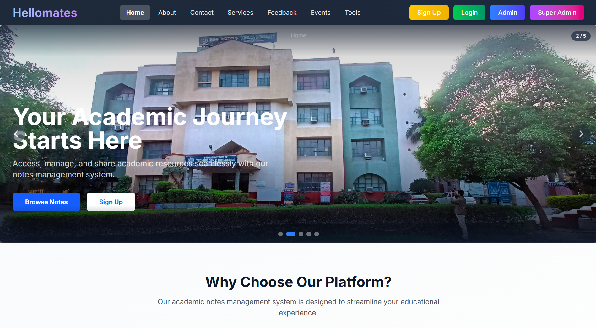

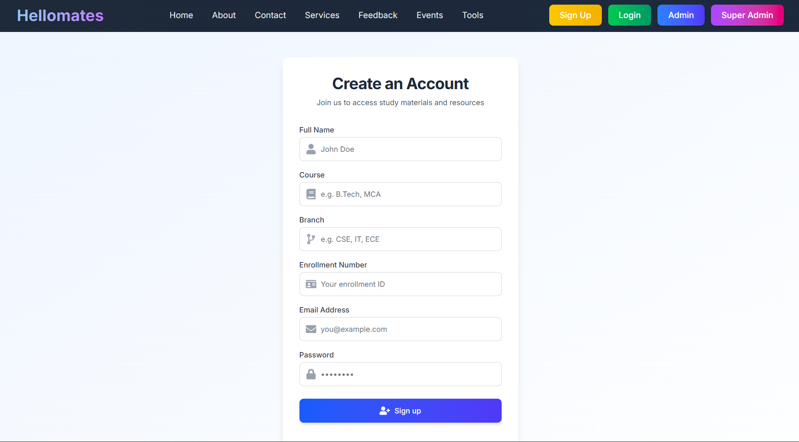

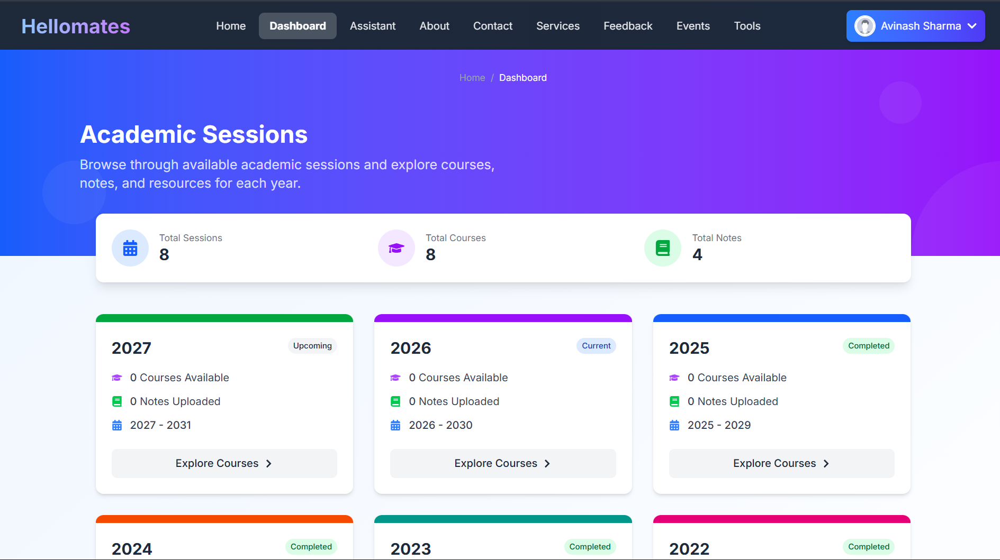

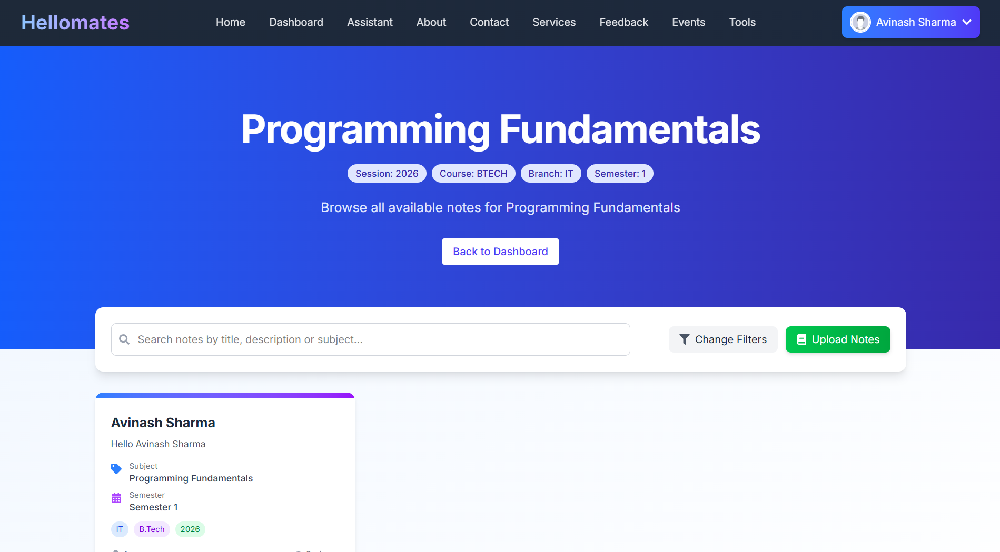

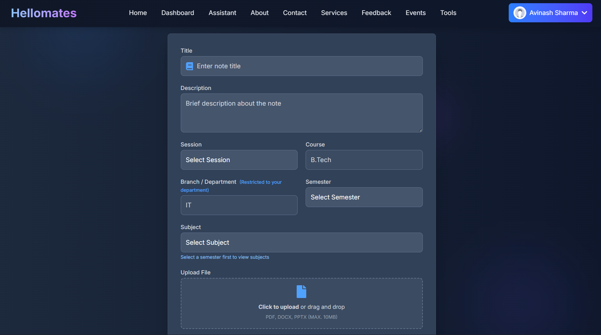

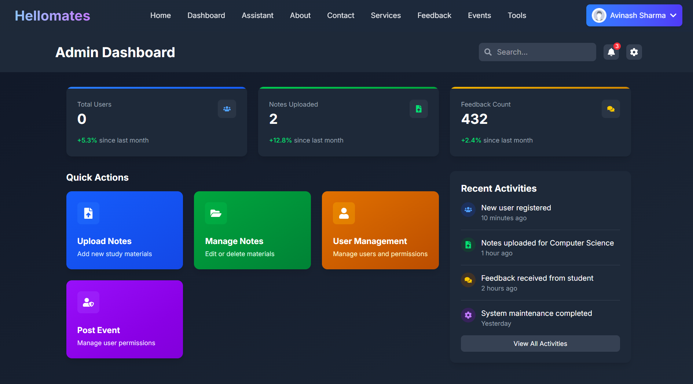

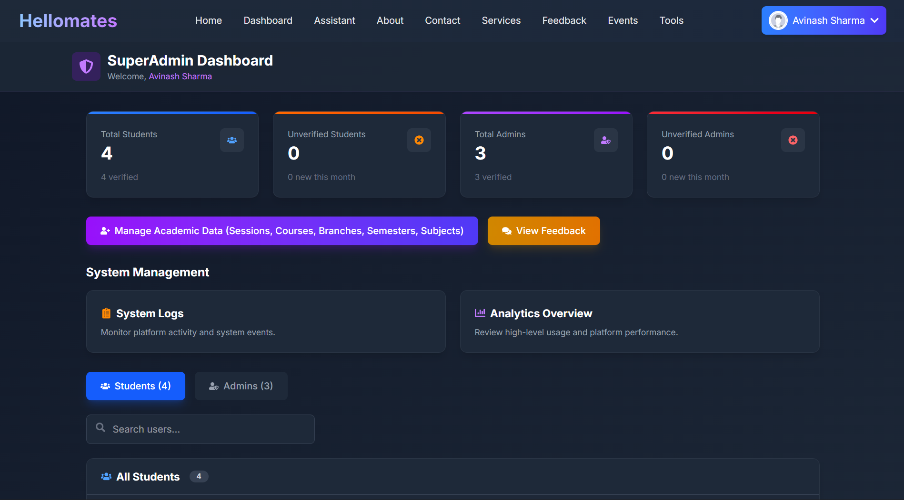

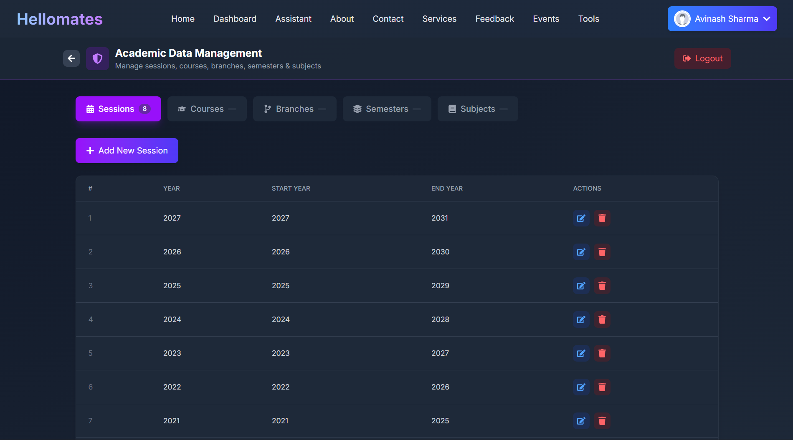

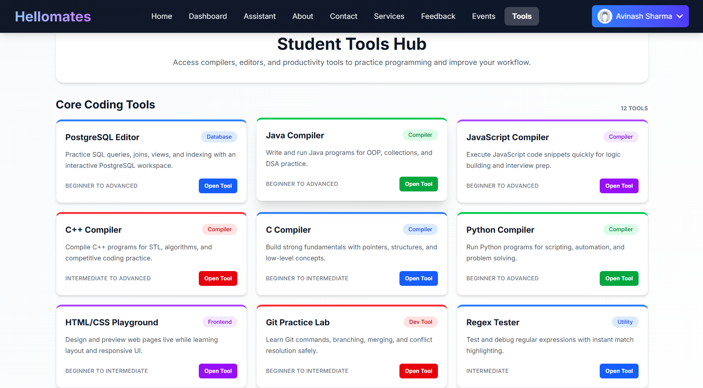

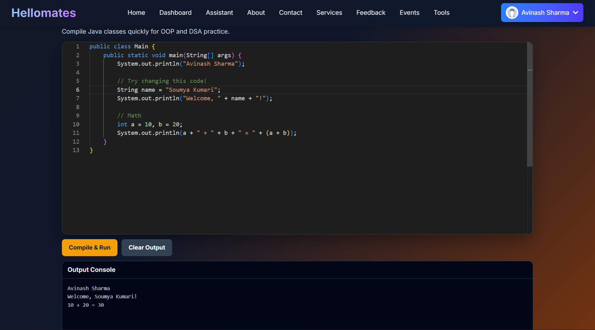

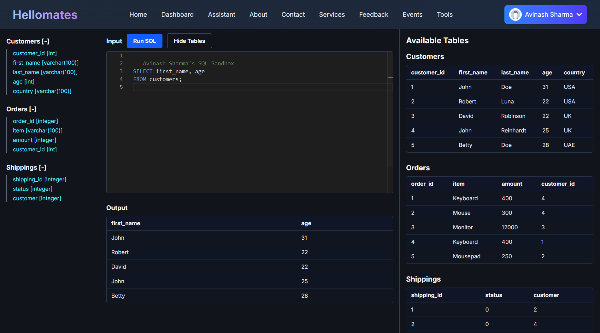

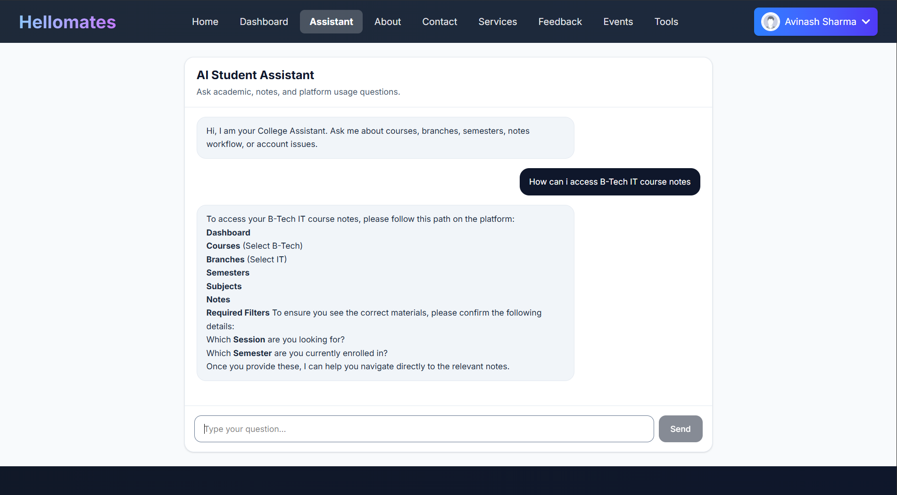

## 5.8 Output Analysis (Representative Responses)

### API Response: /api/notes/home-data

```json
{
  "latestNotes": [
    {
      "_id": "664a1b2c...",
      "title": "Data Structures Unit 1",
      "description": "Introduction to arrays and linked lists",
      "fileUrl": "https://res.cloudinary.com/...",
      "session": "2025-2026",
      "course": "B.Tech",
      "branch": "CSE",
      "semester": "Semester 3",
      "subject": "Data Structures",
      "createdAt": "2026-05-15T10:30:00Z",
      "uploadedBy": { "name": "Prof. Kumar" }
    }
  ],
  "stats": {
    "students": 142,
    "notes": 87,
    "subjects": 35,
    "branches": 8
  },
  "testimonials": [
    {
      "_id": "664b2c3d...",
      "message": "Very helpful platform for finding semester notes",
      "rating": 5,
      "createdAt": "2026-05-10T14:00:00Z",
      "user": { "name": "Student Name", "course": "B.Tech", "branch": "CSE" }
    }
  ]
}
```

### API Response: /api/notes/search?query=algorithms&course=B.Tech&page=1&limit=10

```json
[
  {
    "_id": "664c3d4e...",
    "title": "Design and Analysis of Algorithms",
    "description": "Complete unit covering sorting and searching algorithms",
    "fileUrl": "https://res.cloudinary.com/...",
    "session": "2025-2026",
    "course": "B.Tech",
    "branch": "CSE",
    "semester": "Semester 4",
    "subject": "DAA",
    "uploadedBy": { "name": "Dr. Sharma", "email": "sharma@college.edu" },
    "score": 1.5
  }
]
```

### API Response: /api/query/sandbox (SQL Sandbox)

```json
{
  "rows": [
    {
      "customer_id": 1,
      "first_name": "John",
      "last_name": "Doe",
      "age": 31,
      "country": "USA"
    },
    {
      "customer_id": 2,
      "first_name": "Robert",
      "last_name": "Luna",
      "age": 22,
      "country": "USA"
    }
  ],
  "fields": ["customer_id", "first_name", "last_name", "age", "country"],
  "rowCount": 2
}
```

### API Response: /api/compile/c (C Compiler)

```json
{
  "output": "Hello, World!\n"
}
```

### API Response: /api/superadmin/stats (Dashboard Statistics)

```json
{
  "users": {
    "total": 156,
    "verified": 142,
    "unverified": 14,
    "recentlyJoined": 23
  },
  "admins": {
    "total": 12,
    "verified": 10,
    "unverified": 2,
    "recentlyJoined": 3
  }
}
```

## 5.9 Real-world Applications

The College platform addresses several real-world use cases in the educational domain:

1. **Department-Level Notes Repository**: A B.Tech CSE department can deploy the platform to create a centralized notes repository organized by semester and subject, with faculty members as admins and students as users.

2. **Multi-Course Academic Portal**: Institutions offering multiple courses (B.Tech, BCA, MCA) can use the platform's course-based organization to maintain separate note collections while sharing the same infrastructure.

3. **Internal Academic Tools Hub**: The integrated compilers and SQL sandbox provide students with practice environments for programming courses without requiring separate tool installations.

4. **Event and Announcement Portal**: The events module and public home page provide a channel for college event announcements and community engagement.

5. **Student Feedback Collection**: The structured feedback system with star ratings provides actionable data for course improvement initiatives.

6. **AI-Assisted Learning**: The integrated AI assistant can help students navigate the platform, answer frequently asked questions about academic procedures, and provide general study guidance.

---

# CHAPTER VI: ADVANTAGES, LIMITATIONS AND FUTURE SCOPE

## 6.1 Advantages

1. **Structured Academic Hierarchy**: The five-level hierarchy (Session -> Course -> Branch -> Semester -> Subject -> Notes) mirrors the actual academic structure of Indian universities, making note discovery intuitive and systematic.

2. **Three-Tier RBAC**: The Student/Admin/SuperAdmin role model provides appropriate access controls at each level, with separate authentication cookies and middleware chains ensuring proper isolation.

3. **Cloud-Native File Storage**: Cloudinary integration eliminates local file system dependencies, provides CDN-backed delivery for fast note downloads, and supports automatic format detection for images, PDFs, and other document types.

4. **Integrated Learning Tools**: The Tools Hub with six programming language compilers, a SQL sandbox, and an HTML/CSS playground provides a unified learning environment that reduces the need for external tools.

5. **Full-Text Search with Relevance Scoring**: MongoDB's text index on title, description, and subject fields enables fast, relevance-ranked search results, significantly improving note discoverability compared to manual browsing.

6. **Social Authentication**: Google OAuth support via Firebase reduces registration friction and leverages existing Google accounts that most students already possess.

7. **Containerized Deployment**: Docker Compose profiles for development and production environments ensure reproducible deployments and simplify onboarding for new developers.

8. **Extensible API Design**: The modular controller/route/model architecture with consistent patterns enables straightforward addition of new features without disrupting existing functionality.

9. **Automatic Session Management**: The 15-second session validation polling and custom event-based logout mechanism ensure that expired sessions are promptly detected and handled.

10. **PostgreSQL Sandbox Safety**: The transaction-and-rollback approach ensures that student SQL queries never persist changes to the database, providing a safe experimentation environment.

## 6.2 Limitations (Observed in Repository)

1. **No Automated Test Suite**: The server `package.json` test script is a placeholder (`"test": "echo \"Error: no test specified\" && exit 1"`). No unit tests, integration tests, or end-to-end tests are defined, which limits confidence in regression prevention.

2. **Partial Tool Hub Implementation**: Several learning tools listed in the Tools Hub and documented in the `docs/` directory (regex tester, JSON formatter, DSA visualizer, markdown notes pad, API tester, Linux terminal simulator, ER diagram builder, MCQ practice engine, quiz progress tracker) do not have corresponding routes implemented in `App.jsx`.

3. **High Rate Limiter Thresholds**: Both `loginRateLimiter` and `chatbotRateLimiter` are configured with 1000 requests per 15-minute window, which is effectively unlimited and provides no meaningful protection in production.

4. **Compiler Security Gap**: Code compilation uses `execSync` without OS-level sandboxing (no Docker containers, chroot, or seccomp profiles), which poses security risks if the platform is exposed to untrusted users who could execute malicious code.

5. **No Input Sanitization for Compilers**: User-submitted code is written directly to temporary files and executed. While timeouts and cleanup are implemented, there is no validation against potentially harmful system calls.

6. **Mixed Error Handling Patterns**: Some controllers use the modern `catchAsync + AppError` pattern while others use traditional try-catch with generic "Server error" responses, creating inconsistency in error reporting.

7. **Missing Admin Auth on Some Routes**: The subscribe route's `GET /all` endpoint uses `authorizeAdmin` without preceding `authenticateUser`, which may cause issues depending on the middleware chain execution order.

8. **Environment File Security**: The `.env.example` file contains realistic-looking values that could be mistaken for actual credentials. Production deployment requires careful handling and rotation of all secret values.

9. **No Pagination on User/Admin Lists**: The SuperAdmin's user and admin management endpoints return all records without server-side pagination, which could cause performance issues at scale.

## 6.3 Future Scope (from Project Improvement Documents)

The project documentation outlines several areas for future development:

1. **Analytics Dashboards**: Add comprehensive analytics for admins and super admins including active user trends, top subjects by download count, upload frequency, and peak usage times.

2. **Real-Time Notifications**: Implement WebSocket-based notifications for new note uploads, verification status changes, and admin actions using Socket.io or similar technology.

3. **Semantic Search and Ranking**: Upgrade from keyword-based text search to vector-based semantic search using embedding models, enabling more intelligent note discovery based on content similarity.

4. **Global Request Validation**: Implement a schema-based request validation middleware (e.g., Joi or Zod) across all endpoints to standardize input validation.

5. **Audit Logging**: Add comprehensive audit logs for all administrative actions (user management, academic CRUD, note operations) to support accountability and compliance.

6. **CI/CD Pipeline**: Implement continuous integration and continuous deployment using GitHub Actions or similar tools, with automated testing, linting, and staged deployments.

7. **Automated Test Suite**: Develop comprehensive unit tests (using Jest or Mocha), integration tests (using Supertest), and end-to-end tests (using Cypress or Playwright).

8. **Complete Tools Hub**: Implement all documented tools with fully wired routes:
   - Regex Tester with live matching and group highlighting
   - JSON Formatter with validation and tree view
   - DSA Visualizer with step-by-step algorithm animation
   - Markdown Notes Pad with live preview and export
   - API Tester for browser-based HTTP request testing
   - Linux Terminal Simulator for command-line practice
   - ER Diagram Builder for visual database design
   - MCQ Practice Engine with question banks and scoring
   - Quiz Progress Tracker with analytics

9. **Compiler Sandboxing**: Implement Docker-based code execution isolation for compiler endpoints, using ephemeral containers with resource limits (CPU, memory, network) to prevent security vulnerabilities.

10. **Mobile Application**: Develop native or cross-platform mobile applications (React Native or Flutter) for improved accessibility on mobile devices.

## 6.4 Lessons Learned

1. **Modular Architecture Pays Off**: The separation of concerns between controllers, routes, middleware, and models enabled parallel development and simplified debugging. Each module can be understood and modified independently.

2. **Cookie-Based Auth Complexity**: Cross-origin cookie handling (secure, sameSite, httpOnly) introduces significant complexity, especially during development where HTTP and HTTPS environments behave differently.

3. **Cascading Data Dependencies**: The academic hierarchy's cascading delete behavior (course deletion removing branches, semesters, and subjects) requires careful testing to prevent data loss and ensure referential integrity.

4. **Cloud Service Integration**: Integrating multiple cloud services (Cloudinary, Firebase, MongoDB Atlas) requires careful environment variable management and error handling for service unavailability scenarios.

5. **Frontend-Backend Contract**: The importance of a well-defined API contract between frontend and backend became evident during the cascading dropdown implementation, where the frontend depends on consistent response formats from multiple academic endpoints.

---

# REFERENCES (Author-Year Style)

1. Project Team (2026). The College README.md. Repository documentation. Full-stack architecture reference.
2. Project Team (2026). Server Documentation (server-documentation.md, Doc.md). Backend API and architecture documentation.
3. Project Team (2026). Docker Setup Guide (docs/DOCKER_SETUP.md). Containerization workflow documentation.
4. Project Team (2026). Tool Design Documents (docs/\*.md). Specifications for C, C++, Java, Python, JavaScript, PostgreSQL, HTML/CSS, and advanced tool designs.
5. Project Team (2026). Component Refactoring Report (Related_Data_Testing/MDFiles/Component_Refactoring_Report.md). Frontend architecture improvement analysis.
6. Project Team (2026). Copyright Application and Invention Disclosure (Related_Data_Testing/COPYRIGHT_APPLICATION.md, Related_Data_Testing/MDFiles/INVENTION_DISCLOSURE/README.md). Intellectual property documentation.
7. MongoDB Inc. (2024). MongoDB Manual: Text Indexes. https://www.mongodb.com/docs/manual/core/index-text/
8. Express.js Contributors (2024). Express.js Guide. https://expressjs.com/en/guide/
9. React Team (2024). React Documentation. https://react.dev/
10. Vite Team (2024). Vite Documentation. https://vitejs.dev/
11. Cloudinary (2024). Node.js SDK Documentation. https://cloudinary.com/documentation/node_integration
12. Firebase (2024). Firebase Admin SDK Documentation. https://firebase.google.com/docs/admin/setup
13. Auth0 (2024). JSON Web Token Introduction. https://jwt.io/introduction/
14. Mongoose (2024). Mongoose Documentation: Dynamic References (refPath). https://mongoosejs.com/docs/populate.html#dynamic-ref
15. OWASP Foundation (2024). Authentication Cheat Sheet. https://cheatsheetseries.owasp.org/cheatsheets/Authentication_Cheat_Sheet.html
16. Pressman, R.S. (2014). Software Engineering: A Practitioner's Approach. 8th Edition. McGraw-Hill Education.

---

# TABLE INDEX

- Table 1.1: Existing vs Proposed System
- Table 2.1: Functional Requirements (FR-01 through FR-25)
- Table 2.2: Non-Functional Requirements (NFR-01 through NFR-10)
- Table 2.3: Hardware Requirements (Development and Production)
- Table 2.4: Software Stack and Tools
- Table 2.5: Database Collection Schema (13 collections)
- Table 2.6: Environment Variables Inventory
- Table 2.7: API Endpoint Specification (60+ endpoints across 7 route groups)
- Table 5.1: Authentication Module Test Cases (TC-01 through TC-17)
- Table 5.2: Notes Module Test Cases (TC-18 through TC-28)
- Table 5.3: Academic CRUD Test Cases (TC-29 through TC-36)
- Table 5.4: Compiler Module Test Cases (TC-37 through TC-46)
- Table 5.5: End-to-End Flow Test Cases (TC-47 through TC-52)
- Table 5.6: User Interface Test Cases (TC-53 through TC-62)
- Table 5.7: Security Verification Test Cases (TC-63 through TC-70)
- Table 5.8: Performance Verification (TC-71 through TC-75)

---

# FIGURE INDEX

- Figure 3.1: Overall System Architecture
- Figure 3.2: DFD Level 0 (Context Diagram)
- Figure 3.3: DFD Level 1
- Figure 3.4: ER Diagram (Conceptual)
- Figure 3.5: System Flowchart
- Figure 3.6: Authentication Sequence Diagram
- Figure 3.7: Note Upload Sequence Diagram
- Figure 3.8: Frontend Component Architecture
- Figure 5.1: Home Page Screenshot (placeholder)
- Figure 5.2: Login Screen (placeholder)
- Figure 5.3: Student Dashboard (placeholder)
- Figure 5.4: Notes List with Filters (placeholder)
- Figure 5.5: Upload Notes Form (placeholder)
- Figure 5.6: Admin Panel (placeholder)
- Figure 5.7: SuperAdmin Panel (placeholder)
- Figure 5.8: Academic Management (placeholder)
- Figure 5.9: Tools Hub (placeholder)
- Figure 5.10: Code Compiler (placeholder)
- Figure 5.11: SQL Editor (placeholder)
- Figure 5.12: AI Assistant (placeholder)

---

# APPENDICES

## Appendix A: Backend File Summary (Server)

### Config

- Config/cloudinary.js: Cloudinary SDK initialization using `CLOUDINARY_CLOUD_NAME`, `CLOUDINARY_API_KEY`, and `CLOUDINARY_API_SECRET` environment variables. Configures the v2 SDK for programmatic file management.
- Config/firebaseAdmin.js: Firebase Admin SDK initialization with three strategies: (1) service account JSON file for production, (2) project ID only for development, (3) reuse existing app if already initialized. Uses ESM-compatible `import.meta.url` for `__dirname` resolution.
- Config/FileAllowType.md: Documentation on allowed upload formats for notes (PDF, images, documents).

### Database

- Database/db.js: MongoDB connection helper. Reads `MONGO_URI` with `MONGO_DBLOCAL` fallback. Throws error and exits process (code 1) if neither is configured. Uses Mongoose 8 for connection management.

### Controllers

- Controllers/authController.js (192 lines): User registration with bcrypt hashing (salt=10), login with JWT generation and httpOnly cookie, email verification via JWT URL parameters, profile updates with Cloudinary profile picture support, logout with multi-path cookie clearing, admin-scoped user listing with regex-escaped course matching.
- Controllers/AdminController.js (267 lines): Admin registration with course/department validation against academic database (handles "General" branch auto-assignment for single-branch courses), login/logout, profile and password updates, email verification.
- Controllers/SuperAdminController.js (280 lines): SuperAdmin authentication with separate `SuperauthToken` cookie, dashboard statistics aggregation (total/verified/unverified/recent users and admins within last 30 days), full user and admin management (list, delete, toggle verification), resend verification email support.
- Controllers/AcademicController.js (289 lines): Complete CRUD for five academic entities (20 functions). Implements cascading deletes: Course deletion removes Branches, Semesters, and Subjects; Branch deletion removes Subjects; Semester deletion removes Subjects. All GET operations filter by `isActive: true`. Supports query parameter filtering for hierarchical data.
- Controllers/noteController.js (275 lines): Note upload with multi-step validation chain (admin course matching, semester resolution with name-or-number fallback, branch auto-detection, subject validation). Full-text search with MongoDB `$text` operator and `$meta: "textScore"` relevance sorting. Cloudinary file lifecycle management (upload, update with old file deletion, delete). Public home data aggregation using `Promise.all` for 6 parallel queries.
- Controllers/feedbackController.js (48 lines): Submit feedback with user reference and star rating (1-5), list all feedback with populated user data, delete by ID.
- Controllers/ContactController.js (57 lines): Submit contact form with user reference, list all contacts with populated user data, delete by ID.
- Controllers/SubscribeController.js (130 lines): Newsletter subscription management with duplicate email check, list all subscribers with count, delete by ID, unsubscribe by email.
- Controllers/chatbotController.js (13 lines): Thin controller delegating to chatbotService. Receives `{message, history}`, returns `{reply, model}`.
- Controllers/socialAuthController.js (96 lines): Firebase social login handler. Verifies Firebase ID token server-side, creates or updates User document. Social auth users are auto-verified (`isVerified: true`). Generates same JWT and cookie as regular login.
- Controllers/EventPostController.js: Empty placeholder file for future event management.

### Middleware

- Middleware/authMiddleware.js (70 lines): `authenticateUser` -- extracts JWT from `authToken` cookie, `SuperauthToken` cookie, or `Authorization` header (Bearer token). Verifies and attaches decoded payload to `req.user`. Clears invalid cookies on failure. `authorizeAdmin` -- checks `req.user.role === "admin"`.
- Middleware/SuperAdminMiddleware.js (40 lines): `authenticateSuperAdmin` -- reads `SuperauthToken` cookie or Authorization header, verifies JWT AND checks `decoded.role === "superadmin"`. Attaches to `req.superAdmin`.
- Middleware/uploadMiddleware.js (40 lines): Multer + CloudinaryStorage for notes. Folder: `"collage"`, auto-detected format from MIME type, `resource_type: "auto"`.
- Middleware/multerMiddlewareForProFilePic.js (17 lines): Multer + CloudinaryStorage for profile pictures. Folder: `"profile_pics"`, allowed formats: `["jpg", "png", "jpeg"]`.
- Middleware/RateLimitter.js (23 lines): Two express-rate-limit instances: `loginRateLimiter` (1000 req/15min), `chatbotRateLimiter` (1000 req/15min). Standard headers enabled, legacy headers disabled.
- Middleware/noteLimitter.js: Rate limit skeleton for notes (not active).
- Middleware/authLimitter.js: Rate limit skeleton for auth (not active).

### Models

- Models/UserModel.js: User schema with fields for name, course, branch, enrollment, email (unique), password (optional for social auth), profilePic, isVerified (default false), role (enum: student/admin), authProvider (enum: local/google/github), firebaseUid. Timestamps enabled.
- Models/AdminModel.js: Admin schema with required course field, optional department/college/designation. Email unique. Timestamps enabled.
- Models/SuperAdminModel.js: Minimal SuperAdmin schema with name (trim), email (unique, lowercase), password, role (default "superadmin"). Timestamps enabled.
- Models/Note.js: Note schema with dynamic reference (`refPath: 'uploaderModel'`) for polymorphic uploadedBy association. Text index on `{title, description, subject}`. Cloudinary ID stored for file lifecycle management.
- Models/SessionModel.js: Session with year (unique), startYear, endYear, isActive, createdBy (ref SuperAdmin).
- Models/CourseModel.js: Course with name (unique), code (unique, lowercase), icon, color, isActive, createdBy.
- Models/BranchModel.js: Branch with compound unique index `{name, course}`. References Course. Has fullName and code fields.
- Models/SemesterModel.js: Semester with compound unique index `{number, course}`. References Course. Has name and number fields.
- Models/SubjectModel.js: Subject with compound unique index `{name, branch, semester}`. References Branch, Semester, and Course.
- Models/Feedback.js: Feedback with user reference (required), message (required), rating (Number, min 1, max 5, required).
- Models/ContactUSmodel.js: Contact with user reference, name, email, phone, message (all required). No timestamps.
- Models/SubscribedEmailModel.js: Simple email field with timestamps.
- Models/EventModel.js (83 lines): Rich schema with nested location and organizer objects, type enum, virtual fields (isPast, isUpcoming), pre-save hook for updatedAt.

### Routes

- Routes/authRoutes.js: 12 endpoints for user and admin authentication.
- Routes/AcademicRoutes.js: 20 endpoints (5 public GET + 15 protected CRUD).
- Routes/noteRoutes.js: 6 endpoints including public home-data.
- Routes/feedbackRoutes.js: 3 endpoints (submit, list, delete).
- Routes/ContactRoute.js: 3 endpoints (submit, list, delete).
- Routes/SubscribeRoute.js: 4 endpoints (subscribe, unsubscribe, list, delete).
- Routes/SuperAdminRoute.js: 16 endpoints (auth + management).
- Routes/chatbotRoutes.js: 1 endpoint with rate limiting.

### Compilers

- Compilers/C_Programming/ServerForC.js (48 lines): POST /c route. UUID temp files, gcc compile (10s), execute (5s), cleanup in finally.
- Compilers/CPP_Programing/ServerForCpp.js (48 lines): POST /cpp route. Same pattern with g++ and .cpp extension.
- Compilers/Java/ServerForJava.js (51 lines): POST /java route. Regex class name extraction, isolated directory, javac + java, recursive cleanup.
- Compilers/Python_Compiler/ServerForPython.js (55 lines): POST /python route. python command with py -3 fallback for Windows ENOENT.
- Compilers/PostGres/PostgresCompilier.js (158 lines): 3 routes (direct query, sandbox preview, sandbox execute). Transaction-rollback pattern with pre-seeded temp tables.
- Compilers/PostGres/ConnectionPool.js (16 lines): pg.Pool configuration supporting POSTGRES_URI or individual env vars with optional SSL.

### Utils

- utils/AppError.js (13 lines): Custom Error subclass with statusCode, status ("fail"/"error"), isOperational flag, stack trace capture.
- utils/catchAsync.js (5 lines): HOF wrapping async handlers: `fn => (req, res, next) => Promise.resolve(fn(req, res, next)).catch(next)`.
- utils/UserEmailVerification.js (48 lines): Nodemailer Gmail SMTP transport, JWT token (1h expiry), HTML email with verification link.
- utils/AdminEmailVerification.js: Same pattern for admin verification emails.
- utils/SuperAdminEmailVerification.js: Same pattern for SuperAdmin verification emails.

### Views

- views/UserEmailVerify.ejs, AdminEmailVerify.ejs, SuperAdminEmailVerify.ejs: EJS templates rendered on successful email verification. Display success messages with styled HTML.

### Scripts

- scripts/seedAcademicData.js: Seeds academic data (courses, branches, semesters, subjects) for initial setup.
- scripts/freshSeed.js: Drops existing academic data and re-seeds from scratch.
- scripts/dedupAcademicData.js: Removes duplicate academic records.
- scripts/seedAdademicDataByGPT.js: AI-generated academic seed data.
- scripts/check_admins.js: Utility to inspect admin records in the database.
- scripts/testGeminiKey.js: Tests Gemini API key validity.

---

## Appendix B: Frontend File Summary (Client)

### Root

- index.html: Client entry HTML. Title: "Home | Hellomates". Single `<div id="root">` for React mount.
- vite.config.js: Vite configuration with `/api` proxy to backend (port 5000), COOP/COEP headers for Firebase popup compatibility.
- tailwind.config.js: Tailwind content paths and theme extensions for custom colors and fonts.

### Entry and Core

- src/main.jsx: React root using `createRoot` (React 18). Wraps `<App />` in `<AuthProvider>` and imports Toastify CSS.
- src/App.jsx (179 lines): Central router with `BrowserRouter`, lazy-loaded components via `React.lazy()` + `<Suspense>`, protected route wrappers, conditional Navbar/Footer rendering. Defines 30+ routes across public, user, admin, superadmin, and tools sections.
- src/Api/axiosInstance.js: Axios instance with `baseURL` from `VITE_API_URL`, `withCredentials: true`, response interceptor for 401 handling via custom `session-expired` event.
- src/Context/AuthContext.jsx (289 lines): Global auth state with three user type states, session probe on mount (SA -> Admin -> User priority), 15-second polling validation, login/logout methods for all three roles, Google OAuth flow, custom event listener for unauthorized responses.

### Protected Routes

- src/Config/ProtectedUserRoute.jsx: Checks `AuthContext.user`, redirects to `/login` if unauthenticated.
- src/Config/ProtectedAdminRoute.jsx: Checks `AuthContext.admin`, redirects to `/adminLogin`.
- src/Config/ProtectedSuperAdminRoute.jsx: Checks `AuthContext.superAdmin`, redirects to `/superadmin/login`.

### Firebase

- src/Config/firebase.js: Firebase client initialization with `VITE_FIREBASE_*` env vars. Exports `auth`, `googleProvider`, `githubProvider`.

### Primary Pages

- Pages/Home.jsx: Landing page with hero section, animated typing text, feature grid, stats counters, CTA buttons.
- Pages/Login.jsx: User auth with email/password and Google OAuth. Dark-themed card with gradient styling.
- Pages/SignUp.jsx: User registration with dynamic course/branch dropdowns fetched from API.
- Pages/Contact.jsx: Contact form with name, email, subject, message fields. Toast notifications on submit.
- Pages/Feedback.jsx: Star rating component (1-5) with text feedback. Success confirmation view.
- Pages/Assistant.jsx: Full AI chat interface with sidebar, message bubbles, markdown rendering, conversation history management.

### Admin Pages

- AdminPages/AdminLogin.jsx: Admin auth with FaUserShield icon, dark slate theme.
- AdminPages/AdminDashboard.jsx: Stats cards (Total Users, Notes Uploaded), quick action buttons, recent activity sidebar.
- AdminPages/ManageNotes.jsx: Note management with real-time search, delete confirmation, preview (opens Cloudinary URL).
- AdminPages/NoteUpload/UploadNote.jsx: Multi-step upload form with cascading dropdowns, admin course/department pre-populated and locked.
- AdminPages/AllUsers.jsx: Student list filtered by admin's course.
- AdminPages/AdminProfile.jsx: Admin profile view and edit.
- AdminPages/AllFeedbacks.jsx: Feedback management with view and delete.

### SuperAdmin Pages

- SuperAdminPages/SuperAdminLogin.jsx: Purple-themed auth with FaShieldAlt icon.
- SuperAdminPages/SuperAdminDashboard.jsx (462 lines): 4 stat cards, user/admin tabs with search and pagination (8/page), verify toggle, delete actions.
- SuperAdminPages/AcademicManagement.jsx (421 lines): 5-tab CRUD interface with dynamic form rendering and dependent dropdowns.

### Academic Navigation Components

- Sessions/Dashboard.jsx: Session listing with stats overview, SessionCard components.
- Courses/Courses.jsx: Course cards filtered by session query param.
- Branches/Branches.jsx: Branch cards filtered by course.
- Semesters/Semester.jsx: Semester cards filtered by course.
- Subject/Subjects.jsx: Subject list filtered by branch and semester.
- Notes/NotesList.jsx (359 lines): Notes with advanced client-side filtering (course abbreviation matching, branch alias resolution, semester numeric extraction), admin view toggle.

### Tools Hub and Compilers

- Pages/Compilers/CompilersHome.jsx: Tools catalog with 12 core coding tools and 5 advanced learning tools. Color-coded cards with navigation links.
- Pages/Compilers/PostgressCompiler/PostgresEditor.jsx: Monaco SQL editor, 3-column layout (schema sidebar, editor, results), Ctrl+Enter shortcut.
- Pages/Compilers/C_programming/CEditor.jsx: Monaco C editor with compile & run button.
- Pages/Compilers/Cpp_Compiler/CppEditor.jsx: Monaco C++ editor.
- Pages/Compilers/Java_Compiler/JavaEditor.jsx: Monaco Java editor.
- Pages/Compilers/Python_Compiler/PythonEditor.jsx: Monaco Python editor.
- Pages/Compilers/JSCompilers/JsEditor.jsx: Client-side JS execution via `new Function(code)` with console override.
- Pages/Compilers/HTML_CSS_Playground/HtmlCssPlayground.jsx: Live HTML/CSS editor with iframe preview.
- Pages/Tools/Basic Learning Tools/Git_Practice_Lab/GitPracticeLab.jsx: Interactive Git command simulator.

### Components

- Components/Navbaar/Navbar.jsx: Global nav with scroll-based styling, role-specific links, profile dropdown, mobile menu.
- Components/Navbaar/NavbarBrand.jsx: Logo and brand name.
- Components/Navbaar/NavigationLinks.jsx: Dynamic nav links based on user role.
- Components/Navbaar/AuthButtons.jsx: Login/signup buttons for unauthenticated users.
- Components/Navbaar/ProfileDropdown.jsx: Profile info and logout for authenticated users.
- Components/Footer.jsx: 4-section footer (About, Quick Links, Resources, Contact), newsletter form, social icons, copyright.
- Components/NotFound.jsx: 404 page with navigation back to home.
- Components/Breadcrumb.jsx: Breadcrumb navigation for academic hierarchy.
- Components/Slider.jsx, Carousel.jsx: Image/content carousels for home page.
- Components/CallToAction.jsx: CTA sections with gradient buttons.

---

## Appendix C: Documentation Inventory (docs)

| Document                    | Purpose                                     | Status                |
| --------------------------- | ------------------------------------------- | --------------------- |
| API_TESTER.md               | Browser-based API tester tool design        | Documented only       |
| C_COMPILER.md               | C compiler integration design               | Implemented           |
| CPP_COMPILER.md             | C++ compiler integration design             | Implemented           |
| JAVA_COMPILER.md            | Java compiler integration design            | Implemented           |
| PYTHON_COMPILER.md          | Python compiler integration design          | Implemented           |
| JAVASCRIPT_RUNTIME.md       | JavaScript runtime tool design              | Implemented           |
| POSTGRESQL_EDITOR.md        | SQL editor and backend integration design   | Implemented           |
| HTML_CSS_PLAYGROUND.md      | Live HTML/CSS editor design                 | Implemented           |
| JSON_FORMATTER.md           | JSON formatter/validator tool design        | Documented only       |
| REGEX_TESTER.md             | Regular expression tester design            | Documented only       |
| MARKDOWN_NOTES_PAD.md       | Markdown editor with live preview design    | Documented only       |
| DSA_VISUALIZER.md           | Algorithm step-by-step visualizer design    | Documented only       |
| MCQ_PRACTICE_ENGINE.md      | Multiple choice quiz engine design          | Documented only       |
| QUIZ_PROGRESS_TRACKER.md    | Quiz analytics and progress tracking design | Documented only       |
| LINUX_TERMINAL_SIMULATOR.md | Terminal command simulator design           | Documented only       |
| ER_DIAGRAM_BUILDER.md       | Visual ER diagram builder design            | Documented only       |
| GIT_PRACTICE_LAB.md         | Git command simulator design                | Implemented           |
| RATE_LIMITING.md            | Rate limit integration guidance             | Partially implemented |
| DOCKER_SETUP.md             | Dockerized development/production workflow  | Implemented           |
| ImprovementOfThisProject.md | Future improvement roadmap suggestions      | Reference             |

---

## Appendix D: Related_Data_Testing (Prototype Area)

This directory contains early prototypes, mock data, and testing artifacts developed during the project's iterative design phase:

- AdminProfile.jsx: Mock admin profile UI with sample statistics and activity timeline.
- Testing.jsx, factorial.js: Sample test files and utility code for development testing.
- API/axiosInstance.js, API/AuthContext.jsx: Minimal authentication prototypes used for early API testing before the main implementation.
- services/authService.jsx, feedbackService.jsx, noteService.jsx: Simple API wrapper services exploring a service-layer architecture pattern.
- Pages/\*: Minimal prototype pages (Dashboard, Home, Login, Notes, Register, SearchNotes, UploadNotes) created during the UI design phase.
- StaticPages/Form.html, Hello.html: Standalone HTML prototypes for form layout and basic structure testing.
- MDFiles/Component_Refactoring_Report.md: Detailed analysis of component refactoring decisions and their impact on code quality.
- MDFiles/INVENTION_DISCLOSURE/README.md: Invention disclosure form documenting the novel aspects of the platform.
- MDFiles/README3.md: UTF-16 encoded documentation file (requires conversion for full parsing).
- COPYRIGHT_APPLICATION.md: Copyright application documentation for intellectual property protection.

---

## Appendix E: Glossary and Abbreviations

| Abbreviation | Full Form                               |
| ------------ | --------------------------------------- |
| API          | Application Programming Interface       |
| CDN          | Content Delivery Network                |
| CORS         | Cross-Origin Resource Sharing           |
| CRUD         | Create, Read, Update, Delete            |
| CSS          | Cascading Style Sheets                  |
| DFD          | Data Flow Diagram                       |
| DOM          | Document Object Model                   |
| EJS          | Embedded JavaScript Templates           |
| ER           | Entity-Relationship                     |
| ES           | ECMAScript (JavaScript standard)        |
| ESM          | ECMAScript Modules                      |
| HMR          | Hot Module Replacement                  |
| HOC          | Higher-Order Component                  |
| HTML         | HyperText Markup Language               |
| HTTP         | HyperText Transfer Protocol             |
| HTTPS        | HTTP Secure (TLS encrypted)             |
| IDE          | Integrated Development Environment      |
| JDK          | Java Development Kit                    |
| JSON         | JavaScript Object Notation              |
| JSX          | JavaScript XML (React syntax extension) |
| JWT          | JSON Web Token                          |
| MIME         | Multipurpose Internet Mail Extensions   |
| MVC          | Model-View-Controller                   |
| NGINX        | Engine-X (reverse proxy server)         |
| OAuth        | Open Authorization                      |
| ORM          | Object-Relational Mapping               |
| ODM          | Object-Document Mapper                  |
| RBAC         | Role-Based Access Control               |
| REST         | Representational State Transfer         |
| SDK          | Software Development Kit                |
| SPA          | Single Page Application                 |
| SMTP         | Simple Mail Transfer Protocol           |
| SQL          | Structured Query Language               |
| SSL          | Secure Sockets Layer                    |
| SRS          | Software Requirement Specification      |
| TLS          | Transport Layer Security                |
| UI           | User Interface                          |
| UUID         | Universally Unique Identifier           |
| UX           | User Experience                         |
| XSS          | Cross-Site Scripting                    |
| CSRF         | Cross-Site Request Forgery              |
| vCPU         | Virtual Central Processing Unit         |

---

## Appendix F: Additional Test Cases (Extended)

### Table F.1: Subscription Module Test Cases

| TC ID | Test Case             | Input                                   | Expected Output           | Status      |
| ----- | --------------------- | --------------------------------------- | ------------------------- | ----------- |
| TC-76 | Subscribe (valid)     | POST /api/subscribe {email}             | 200: Subscription success | [PASS/FAIL] |
| TC-77 | Subscribe (duplicate) | Same email again                        | 400: "Already subscribed" | [PASS/FAIL] |
| TC-78 | Unsubscribe           | POST /api/subscribe/unsubscribe {email} | 200: Unsubscribe success  | [PASS/FAIL] |
| TC-79 | List subscribers      | GET /api/subscribe/all (admin)          | 200: Array with count     | [PASS/FAIL] |
| TC-80 | Delete subscriber     | DELETE /api/subscribe/:id (admin)       | 200: Subscriber deleted   | [PASS/FAIL] |

### Table F.2: SuperAdmin Management Test Cases

| TC ID | Test Case                 | Input                                 | Expected Output                   | Status      |
| ----- | ------------------------- | ------------------------------------- | --------------------------------- | ----------- |
| TC-81 | SuperAdmin stats          | GET /api/superadmin/stats             | User/admin counts with breakdowns | [PASS/FAIL] |
| TC-82 | Toggle user verification  | PUT /api/superadmin/users/:id/verify  | isVerified toggled                | [PASS/FAIL] |
| TC-83 | Delete user               | DELETE /api/superadmin/users/:id      | User removed from DB              | [PASS/FAIL] |
| TC-84 | Toggle admin verification | PUT /api/superadmin/admins/:id/verify | isVerified toggled                | [PASS/FAIL] |
| TC-85 | Delete admin              | DELETE /api/superadmin/admins/:id     | Admin removed from DB             | [PASS/FAIL] |

### Table F.3: Edge Case Test Cases

| TC ID | Test Case                     | Input                                  | Expected Output                  | Status      |
| ----- | ----------------------------- | -------------------------------------- | -------------------------------- | ----------- |
| TC-86 | Upload note (General auto)    | Course with single "General" branch    | Branch auto-set to "General"     | [PASS/FAIL] |
| TC-87 | Semester resolution by number | semester="Semester 3" (name not found) | Resolves by extracting number 3  | [PASS/FAIL] |
| TC-88 | Python fallback to py -3      | Windows environment without python cmd | Falls back to py -3 successfully | [PASS/FAIL] |
| TC-89 | Java class name extraction    | public class MyApp (non-Main name)     | Regex extracts "MyApp" correctly | [PASS/FAIL] |
| TC-90 | SQL multi-statement           | SELECT 1; SELECT \* FROM customers     | Returns last statement result    | [PASS/FAIL] |

---

## Appendix G: API Response Samples

### Successful User Login Response

```
HTTP/1.1 200 OK
Set-Cookie: authToken=eyJhbGciOiJIUzI1NiIs...; Path=/; HttpOnly; Secure; SameSite=None; Max-Age=86400

{
  "user": {
    "id": "664a1b2c3d4e5f6g7h8i9j0k",
    "name": "John Doe",
    "course": "B.Tech",
    "branch": "CSE",
    "enrollment": 2023001,
    "email": "john@example.com",
    "role": "student"
  }
}
```

### Note Upload Success Response

```
HTTP/1.1 201 Created

{
  "message": "Note uploaded successfully!",
  "note": {
    "_id": "664b2c3d4e5f6g7h8i9j0k1l",
    "title": "Operating Systems Unit 2",
    "description": "Process scheduling and deadlocks",
    "fileUrl": "https://res.cloudinary.com/dxxxxxxxx/raw/upload/v1716000000/collage/abc123.pdf",
    "cloudinaryId": "collage/abc123",
    "uploadedBy": "664c3d4e5f6g7h8i9j0k1l2m",
    "uploaderModel": "Admin",
    "session": "2025-2026",
    "course": "B.Tech",
    "branch": "CSE",
    "semester": "Semester 4",
    "subject": "Operating Systems",
    "createdAt": "2026-05-15T10:30:00.000Z",
    "updatedAt": "2026-05-15T10:30:00.000Z"
  }
}
```

### Global Error Response (Operational)

```
HTTP/1.1 400 Bad Request

{
  "status": "fail",
  "message": "All fields are required"
}
```

### Global Error Response (Non-Operational)

```
HTTP/1.1 500 Internal Server Error

{
  "status": "error",
  "message": "Something went wrong. Please try again later."
}
```

---

## Appendix H: Deployment Configuration

### Docker Compose Configuration

The project includes a `docker-compose.yml` file with two profiles:

**Development Profile** (`docker compose --profile dev up --build`):

- Hot-reload enabled via volume mounts for both client and server directories.
- Vite dev server with proxy configuration for API calls.
- MongoDB container with persistent volume.
- Environment variables loaded from `.env.docker`.

**Production Profile** (`docker compose --profile prod up --build`):

- Vite production build served via Nginx.
- Express server in production mode.
- Nginx reverse proxy handling static file serving and API proxying.
- Optimized container images with multi-stage builds.

### Nginx Configuration (Production)

In production, Nginx serves as a reverse proxy with the following configuration:

- Static files (React build output) served directly from the filesystem.
- API requests (`/api/*`) proxied to the Express backend.
- WebSocket upgrade headers configured for future real-time features.
- Gzip compression enabled for text-based assets.

### Environment Configuration Strategy

The project uses a layered environment variable strategy:

- `.env`: Local development (gitignored).
- `.env.example`: Template with placeholder values (committed).
- `.env.docker`: Docker-specific overrides (gitignored).
- `.env.docker.example`: Docker template (committed).

The `VITE_` prefix convention ensures that only client-safe variables are exposed to the browser bundle, while server-side secrets remain inaccessible from frontend code.

---

END OF REPORT
